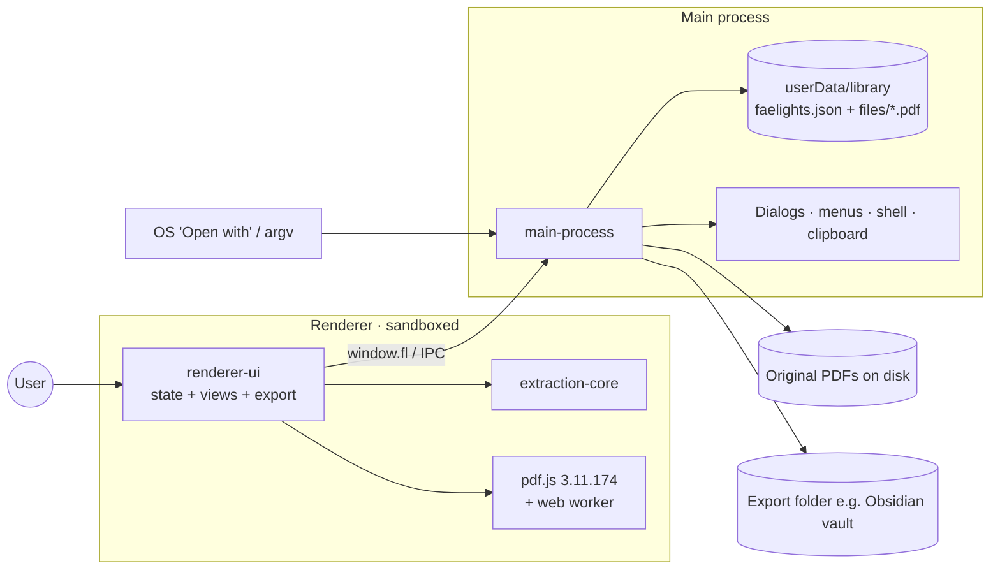

# Faelights — Project Compass
> Last updated: 2026-10-08 · Last logged commit: 18c8052 · Version: 1.0.0

## 1. Snapshot
Faelights is a local-first desktop app (Electron, Windows/macOS/Linux) that pulls highlights, underlines and strike-throughs out of annotated PDFs. It shows them in reading order, grouped by topic, and keeps PDFs in libraries that can be tagged, starred, searched and exported to Markdown, Obsidian or plain text. It is aimed at people who read and annotate PDFs (students, researchers) and want their highlights in a notes tool such as Obsidian or Notion (audience inferred from README; unverified). Status: v1.0.0, feature-complete for its first release, all in one initial commit (2026-10-08). There are no automated tests, and installers are built in CI but not published.

## 2. Vision & scope
- **Goals:**
  - Reliable extraction of every markup annotation, with its page, colour and note.
  - Context in two views: *Full sentence* or *Highlights only*.
  - Topic grouping from bookmarks, with headings as a fallback.
  - Organisation through libraries, tags and stars, plus search across every PDF.
  - Clean export into personal knowledge tools, especially an Obsidian vault.
  - Highlights survive the original PDF moving or being deleted.
- **Non-goals:**
  - Cloud sync, accounts or any network service. Nothing in the code makes network calls.
  - Annotating or editing PDFs inside the app.
  - OCR. Marks over scanned pages are listed as "loose" and the user is told to OCR the file outside the app.
- **Success criteria (unverified):** highlights from common readers (Acrobat, Preview, Zotero and similar) extract correctly; exports drop into Obsidian without cleanup.

## 3. Architecture
### Diagram


### Components
| Component | Responsibility | Tech | Atlas link |
|---|---|---|---|
| Main process | Storage, file copies, dialogs, menus, OS integration | Electron main, Node fs | [main-process](atlas/modules/main-process.md) |
| Preload bridge | Narrow `window.fl` API from renderer to main | `contextBridge` | [preload-bridge](atlas/modules/preload-bridge.md) |
| Extraction core | PDF text stream, annotation hit-testing, sentence and topic grouping | Plain JS over pdf.js | [extraction-core](atlas/modules/extraction-core.md) |
| Renderer UI | Three-pane UI, search, export formatting | Vanilla JS + CSS, no framework | [renderer-ui](atlas/modules/renderer-ui.md) |
| Packaging | Installers and CI builds | electron-builder, GitHub Actions | [packaging](atlas/modules/packaging.md) |

### Tech stack
| Layer | Choice | Version | Why chosen |
|---|---|---|---|
| Shell | Electron | ^31 | Cross-platform desktop with filesystem access (→ D-001) |
| PDF parsing | pdfjs-dist | 3.11.174 (pinned) | Exposes text content and annotation geometry (→ D-003) |
| UI | Vanilla JS / DOM, immediate-mode re-render | — | No build step (→ D-004) |
| Storage | Single JSON file + copied PDFs | — | Local-first, inspectable (→ D-002) |
| Fonts | @fontsource Figtree, Newsreader, Young Serif | ^5 | Bundled offline fonts |
| Packaging | electron-builder | ^24.13.3 | NSIS/zip, dmg, AppImage |
| CI | GitHub Actions | — | Matrix build per OS |

### Data model (high level)
- **Library:** a named container. `inbox` is a built-in system library that can't be deleted.
- **Doc:** one imported PDF. It belongs to exactly one library and carries tags, a star, its original path, the path of its stored copy, the last-scanned mtime, and the cached extraction `result`.
- **Result:** entries (sentence + highlighted spans + topic), loose marks, and topics. It is cached so the UI never re-parses the PDF unless a rescan is triggered.
- **Settings:** view mode, export format and list sort.

### Key flows
- **Add:** the PDF is copied into the library, analysed in the renderer, and its result is saved into the JSON DB.
- **Sync on change:** at startup the original's mtime is compared with the last scan. Docs that have changed show as "Changed" and rescan automatically when opened. When the original is missing, the stored copy is used and the user is offered "Find original file".
- **Search:** in-memory AND-match over sentence, highlight, note and topic text across all cached results.
- **Export:** one note per PDF, with optional YAML frontmatter, written to a file or to a folder per library.

## 4. External services & integrations
| Service | Purpose | Where configured | Env var NAMES | Limits / cost | If it fails… |
|---|---|---|---|---|---|
| GitHub Actions | Build installers on `v*` tags | `.github/workflows/build.yml` | none | Free tier minutes | No installers. Build locally with `npm run dist:*`. |
| OS shell / file associations | "Open with" for `.pdf`, open/reveal files | `package.json build.fileAssociations` | none | — | Users add PDFs from inside the app instead |

There are no network APIs, analytics or telemetry. The app reads no environment variables.

## 5. Environments & deployment
| Env | Target | Branch | How it deploys | Notes |
|---|---|---|---|---|
| Local dev | `npm start` | any | manual | Node 18+ |
| Release builds | GitHub Actions artifacts | tag `v*` | push tag → matrix build | `--publish never`. Artifacts are downloaded by hand from the run. |

- **CI/CD:** checkout → Node 20 → `npm ci || npm install` → `electron-builder` per OS → upload `.exe/.zip/.dmg/.AppImage`.
- **Code signing:** none. Windows `signAndEditExecutable: false`; macOS is not notarised, so Gatekeeper will warn (unverified).
- **Data migrations:** none. `loadDb` only adds a missing Inbox and missing settings defaults. The DB has `version: 1`, but nothing reads it yet.
- **Rollback:** reinstall the previous installer. User data in `userData/library` is untouched by install and uninstall (unverified for the NSIS uninstaller).
- **Secrets:** none.
- **App icon:** `build/icon.png` is referenced but not committed (see Tech debt).

## 6. UI & UX
- **Design system:** CSS custom properties in `renderer/styles.css`, with a light palette (lavender-grey background, amber accent `#B8721A`, glow `#F4B23E`) and an automatic dark palette through `prefers-color-scheme`. Fonts: Young Serif for display, Figtree for UI, Newsreader for reading text. Highlight marks use the PDF annotation's own colour at reduced alpha.
- **Screen map:**
  ```
  Window (3-pane grid)
  ├── Sidebar: brand · Add PDFs · Search / All PDFs / Starred · Libraries (+ new) · Tags · footer (stale count, Rescan)
  ├── List: view title · filter box · sort · progress meter · PDF cards (marks, pages, colour swatches, Changed / Original moved)
  └── Reader: title (click to rename) · library/star/tags · Full/Only toggle · format select · Copy · Export
               ├── Rail: colour filter chips · Topics TOC
               └── Groups by topic → extracts (page, quote, notes, copy-one)
  Search view (list pane hidden): query · library scope · mode toggle → results by PDF, click to jump
  Empty states: onboarding with "Try a sample PDF" + shortcut legend
  ```
- **State:** one global state object, re-rendered fully on each change. Persistence is debounced (250 ms) and saves the whole DB.
- **Interaction:** native context menus (library, doc), drag PDFs from the OS onto the window or onto a library, drag docs between libraries, keyboard (↑↓/J K, Delete, Ctrl/⌘ shortcuts from the app menu).
- **Accessibility:** ARIA labels on icon buttons and inputs, `aria-current`/`aria-pressed` states, `:focus-visible` outlines, and a `role=status` toast.
- **Responsive:** minimum window 900×560. Columns narrow below 1100 px.

## 7. Feature log (newest first)
### F-001 · Faelights desktop v1.0.0 · 2026-10-08 · shipped
- **Why:** turn annotated PDFs into organised, exportable highlight notes, offline.
- **How:**
  - Electron app with a sandboxed renderer. All disk and OS access goes through a small IPC bridge.
  - In-renderer extraction using pdf.js: the text stream is rebuilt, annotation quads are hit-tested per character, edges snap to words, marks expand to whole sentences, and topics come from bookmarks or font-size headings.
  - Libraries, tags, stars, cross-PDF search, colour filtering, and two reading modes.
  - Each PDF is copied into the app's library, with mtime-based staleness detection, auto-rescan and relinking.
  - Export to Markdown, Obsidian or plain text, per PDF or as a folder per library with YAML frontmatter.
  - electron-builder installers for 3 OSes, built in GitHub Actions.
- **Touched:** all modules (see [ATLAS](atlas/ATLAS.md)).
- **Added:** deps electron, electron-builder, pdfjs-dist, @fontsource ×3. `.pdf` file association. CI workflow.
- **Trade-offs:** whole-DB JSON saves (simple, but cost grows with library size); analysis runs on the renderer thread apart from the pdf.js worker; no tests (see D-002, D-004).
- **Known limits / follow-ups:** no OCR; flattened annotations can't be read; no app icon; unsigned builds.
- **Commit range:** 18c8052 (reconstructed from git: the entire app arrived in the initial commit)

## 8. Decision log
### D-001 · Electron desktop, local-only · 2026-10-08 (reconstructed)
Context: the app needs to read PDFs from arbitrary folders, follow edits to the originals, and write into vaults. Options: web app, Electron, native. Decision: Electron with `contextIsolation`, `sandbox` and no `nodeIntegration`. Consequences: a large installer, but full file access and an OS "Open with" integration. Security is kept by routing every OS action through named IPC channels.

### D-002 · Single JSON DB + copied PDFs · 2026-10-08 (reconstructed)
Context: highlights must survive the original being deleted, and storage should be inspectable. Options: SQLite, JSON file, sidecar files. Decision: one `faelights.json` (atomic tmp+rename, serialised writes, `.broken-*` backup on parse failure) plus a copy of each PDF in `files/`. Consequences: no migrations framework; the whole DB is rewritten on every change; disk use doubles per PDF.

### D-003 · pdf.js in the renderer, pinned 3.11.174 · 2026-10-08 (reconstructed)
Context: annotation geometry and text positions are needed together. Decision: use pdf.js's `getTextContent` and `getAnnotations` directly, pinned to an exact version because extraction relies on its annotation object shape. Consequences: upgrading pdf.js means re-testing extraction (v4+ changes the build paths and module format; unverified).

### D-004 · No framework, no bundler · 2026-10-08 (reconstructed)
Decision: plain `<script>` tags with globals and full re-render on each state change. Consequences: zero build step and fast iteration; scaling the UI will need care, and there is no module system or type checking.

## 9. Roadmap & deployment plan
No roadmap is recorded yet. The candidates below are drawn from known limits (unverified priority):
### Now
- (none set)
### Next
- App icon (`build/icon.png`) so installers are branded. Status: open.
- Smoke tests for `core.js` extraction against `renderer/sample.pdf` (it is already Node-exportable). Status: open.
### Later
- Code signing and notarisation; publishing GitHub Releases from CI.
- DB schema versioning and migrations, and per-doc result storage if the library grows large.
- Move analysis off the UI thread (worker).
### Done
- Initial release v1.0.0 · 2026-10-08 · F-001

## 10. Conventions & guardrails
- Keep the renderer sandboxed. New OS access means a new `ipcMain.handle` + `fl.*` wrapper, and never `nodeIntegration`.
- `core.js` stays pure: no DOM and no `fl`.
- Never modify the user's original PDF. Only the stored copy in `userData/library/files` may be written or deleted.
- Removing a library never loses docs; they move to Inbox.
- Any `node_modules` file the renderer references must also be listed in `package.json build.files`.
- Keep the CSP in `index.html` strict: no inline scripts and no remote origins.
- Changing the DB or `result` shape requires a load-time repair or migration in `main.js loadDb`, or a forced rescan.

## 11. Tech debt & open questions
| Item | Impact | Introduced by | Suggested fix |
|---|---|---|---|
| `build/icon.png` missing | Installers use the default Electron icon | F-001 | Add icon assets under `build/` |
| No automated tests | Extraction regressions go unnoticed | F-001 | Node test running `analyzePdf` on fixture PDFs |
| Whole DB (including all results) saved on every change | Slow saves with large libraries | F-001 / D-002 | Split results per doc or move to SQLite |
| `saveDb` errors are only logged | Silent data loss is possible | F-001 | Surface failures to the renderer as a toast |
| Unsigned builds | OS warnings on install | F-001 | Sign and notarise in CI |
| DB `version` field unused | No migration path | F-001 | Add version-based migrations in `loadDb` |
| Open question: target audience and distribution channel (GitHub only?) | Affects signing and auto-update priority | — | Ask the owner |

## 12. Resume checklist
1. Read this file, then [docs/atlas/ATLAS.md](atlas/ATLAS.md).
2. `npm install && npm start` (Node 18+). Try "Try a sample PDF" on an empty library.
3. Tests: none yet.
4. Build: `npm run dist:win|mac|linux`, or push a `v*` tag for CI.
5. User data lives at `<userData>/library` (*File → Show Library Folder*).
6. After a feature: run codebase-atlas `sync`, then project-compass `log`.
