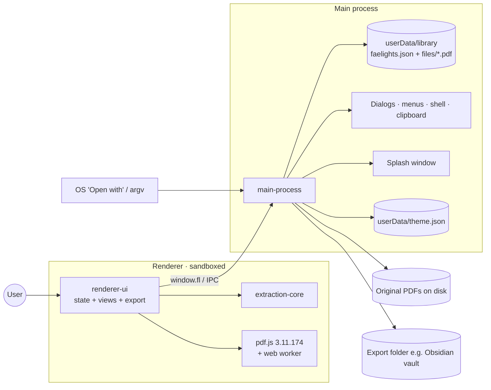

# Faelights — Project Compass
> Last updated: 2026-10-09 · Last logged commit: 1b3b232 · Version: 1.0.0 (unreleased changes on main)

## 1. Snapshot
Faelights is a local-first desktop app (Electron, Windows/macOS/Linux) that pulls highlights, underlines and strike-throughs out of annotated PDFs. It shows them in reading order, grouped by topic, and keeps PDFs in libraries that can be tagged, starred, searched and exported to Markdown, Obsidian or plain text. It is aimed at people who read and annotate PDFs (students, researchers) and want their highlights in a notes tool such as Obsidian or Notion (audience inferred from README; unverified). Status: v1.0.0 shipped in the initial commit (2026-10-08). Since then, unreleased work on `main` has added smarter topic fallbacks with an "Abstract" group (F-002), brand icons, logo and a splash screen (F-003), a light/dark/system theme toggle (F-004), and resizable, collapsible columns with slimmer scrollbars (F-005), and a Zotero-style PDF info panel above the extracts (F-006, on branch `feature/pdf-metadata-panel`). There are no automated tests, and installers are built in CI but not published.

## 2. Vision & scope
- **Goals:**
  - Reliable extraction of every markup annotation, with its page, colour and note.
  - Context in two views: *Full sentence* or *Highlights only*.
  - Topic grouping from bookmarks, falling back to headings by font size, then by wording, then by page, so every PDF is navigable.
  - Organisation through libraries, tags and stars, plus search across every PDF.
  - Clean export into personal knowledge tools, especially an Obsidian vault.
  - Highlights survive the original PDF moving or being deleted.
- **Non-goals:**
  - Cloud sync, accounts or any network service. Nothing in the code makes network calls.
  - Annotating or editing PDFs inside the app.
  - OCR. Marks over scanned pages are listed as "loose" and the user is told to OCR the file outside the app.
- **Success criteria (unverified):** highlights from common readers (Acrobat, Preview, Zotero and similar) extract correctly; exports drop into Obsidian without cleanup.

## 3. Architecture
### Diagram


### Components
| Component | Responsibility | Tech | Atlas link |
|---|---|---|---|
| Main process | Storage, file copies, dialogs, menus, OS integration | Electron main, Node fs | [main-process](atlas/modules/main-process.md) |
| Preload bridge | Narrow `window.fl` API from renderer to main | `contextBridge` | [preload-bridge](atlas/modules/preload-bridge.md) |
| Extraction core | PDF text stream, annotation hit-testing, sentence and topic grouping | Plain JS over pdf.js | [extraction-core](atlas/modules/extraction-core.md) |
| Renderer UI | Three-pane UI, search, export formatting | Vanilla JS + CSS, no framework | [renderer-ui](atlas/modules/renderer-ui.md) |
| Packaging | Installers and CI builds | electron-builder, GitHub Actions | [packaging](atlas/modules/packaging.md) |

### Tech stack
| Layer | Choice | Version | Why chosen |
|---|---|---|---|
| Shell | Electron | ^31 | Cross-platform desktop with filesystem access (→ D-001) |
| PDF parsing | pdfjs-dist | 3.11.174 (pinned) | Exposes text content and annotation geometry (→ D-003) |
| UI | Vanilla JS / DOM, immediate-mode re-render | — | No build step (→ D-004) |
| Storage | Single JSON file + copied PDFs | — | Local-first, inspectable (→ D-002) |
| Fonts | @fontsource Figtree, Newsreader, Young Serif | ^5 | Bundled offline fonts |
| Packaging | electron-builder | ^24.13.3 | NSIS/zip, dmg, AppImage |
| CI | GitHub Actions | — | Matrix build per OS |

### Data model (high level)
- **Library:** a named container. `inbox` is a built-in system library that can't be deleted.
- **Doc:** one imported PDF. It belongs to exactly one library and carries tags, a star, its original path, the path of its stored copy, the last-scanned mtime, and the cached extraction `result`.
- **Result:** entries (sentence + highlighted spans + topic), loose marks, and topics. It is cached so the UI never re-parses the PDF unless a rescan is triggered.
- **Settings:** view mode, export format, list sort and column layout (widths + hidden state per column) in the DB. The theme is stored separately in `theme.json`, owned by the main process (→ D-005).

### Key flows
- **Add:** the PDF is copied into the library, analysed in the renderer, and its result is saved into the JSON DB.
- **Sync on change:** at startup the original's mtime is compared with the last scan. Docs that have changed show as "Changed" and rescan automatically when opened. When the original is missing, the stored copy is used and the user is offered "Find original file".
- **Startup:** a splash window shows the logo while the main window loads, and is swapped out once the library has rendered (→ D-006).
- **Search:** in-memory AND-match over sentence, highlight, note and topic text across all cached results.
- **Export:** one note per PDF, with optional YAML frontmatter, written to a file or to a folder per library.

## 4. External services & integrations
| Service | Purpose | Where configured | Env var NAMES | Limits / cost | If it fails… |
|---|---|---|---|---|---|
| GitHub Actions | Build installers on `v*` tags | `.github/workflows/build.yml` | none | Free tier minutes | No installers. Build locally with `npm run dist:*`. |
| OS shell / file associations | "Open with" for `.pdf`, open/reveal files | `package.json build.fileAssociations` | none | — | Users add PDFs from inside the app instead |

There are no network APIs, analytics or telemetry. The app reads no environment variables.

## 5. Environments & deployment
| Env | Target | Branch | How it deploys | Notes |
|---|---|---|---|---|
| Local dev | `npm start` | any | manual | Node 18+ |
| Release builds | GitHub Actions artifacts | tag `v*` | push tag → matrix build | `--publish never`. Artifacts are downloaded by hand from the run. |

- **CI/CD:** checkout → Node 20 → `npm ci || npm install` → `electron-builder` per OS → upload `.exe/.zip/.dmg/.AppImage`.
- **Code signing:** none. Windows `signAndEditExecutable: false`; macOS is not notarised, so Gatekeeper will warn (unverified).
- **Data migrations:** none. `loadDb` only adds a missing Inbox and missing settings defaults. The DB has `version: 1`, but nothing reads it yet.
- **Rollback:** reinstall the previous installer. User data in `userData/library` is untouched by install and uninstall (unverified for the NSIS uninstaller).
- **Secrets:** none.
- **App icon:** `build/icon.png` (the brand mark on a dark rounded tile, F-003) is used for all three platforms through `directories.buildResources: build`.
- **Local Windows build note:** on this machine (Node 26), `electron`'s postinstall did not extract its binary, so it was unzipped by hand. Build with `npx electron-builder --win --config.electronDist=node_modules/electron/dist` to avoid re-downloading Electron.

## 6. UI & UX
- **Design system:** CSS custom properties in `renderer/styles.css`, with a light palette (lavender-grey background, amber accent `#B8721A`, glow `#F4B23E`) and a dark palette through `prefers-color-scheme`. The user picks System, Light or Dark (F-004), which sets the media query app-wide. Fonts: Young Serif for display, Figtree for UI, Newsreader for reading text. Highlight marks use the PDF annotation's own colour at reduced alpha.
- **Brand:** a lowercase "faelights" wordmark (Young Serif) next to the **mark** (a highlight stroke plus a glowing mote). The **mote** alone is used for small accents. Every asset has light and dark variants in `renderer/assets/brand/`. The app icon is the mark on a dark rounded tile.
- **Screen map:**
  ```
  Window (3-pane grid; every column resizable by drag and hideable to a slim labelled strip)
  Splash (frameless 440×280): mark + wordmark + "Gathering your highlights…"
  ├── Sidebar: brand (mark + wordmark) · Add PDFs · Search / All PDFs / Starred · Libraries (+ new) · Tags · footer (stale count, Rescan · theme icon switch)
  ├── List: view title · filter box · sort · progress meter · PDF cards (marks, pages, colour swatches, Changed / Original moved)
  └── Reader: title (click to rename) · library/star/tags · Info toggle · Full/Only toggle · format select · Copy · Export
               ├── Rail (own scroll, resizable, hideable): colour filter chips · Topics TOC
               ├── Info card (when toggled on): Zotero-style fields (type, title, authors, abstract, publication, DOI/arXiv links…) + File details
               └── Groups by topic → extracts (page, quote, notes, copy-one)
  Search view (list pane hidden): query · library scope · mode toggle → results by PDF, click to jump
  Empty states: mote + onboarding with "Try a sample PDF" + shortcut legend
  Topics: extracts before the first topic sit under "Abstract"
  ```
- **State:** one global state object, re-rendered fully on each change. Persistence is debounced (250 ms) and saves the whole DB.
- **Interaction:** native context menus (library, doc), drag PDFs from the OS onto the window or onto a library, drag docs between libraries, keyboard (↑↓/J K, Delete, Ctrl/⌘ shortcuts from the app menu).
- **Accessibility:** ARIA labels on icon buttons and inputs, `aria-current`/`aria-pressed` states, `:focus-visible` outlines, and a `role=status` toast.
- **Layout:** the sidebar, PDF list and topics rail can each be resized by dragging the handle at their right edge and hidden with a panel button (or Ctrl+B / Ctrl+Shift+B / Ctrl+Alt+B, View menu). A hidden column becomes a 34 px strip with a vertical label that reopens it. Dragging below the minimum snaps the column shut. Double-click a handle to reset it; View → Reset Column Widths resets all. Handles are focusable separators (←/→ resize, Enter toggles).
- **Scrollbars:** slim rounded thumbs in the muted tone that firm up when their pane is hovered and turn accent while dragged.
- **Responsive:** minimum window 900×560. On narrow windows the list, then the sidebar, give up width so the reader keeps at least 420 px; the topics rail hides when the reader is under 600 px.
- **Motion:** the brand SVGs pulse and the splash fades in; both stop under `prefers-reduced-motion`.

## 7. Feature log (newest first)
### F-006 · PDF info panel (Zotero-style metadata) · 2026-10-09 · shipped (on branch)
- **Why:** users wanted to see a paper's bibliographic details (authors, DOI, publication, dates) next to its highlights, like Zotero's Info pane, without leaving the app.
- **How:**
  - Metadata is read from the PDF itself: XMP (Dublin Core and PRISM fields) first, then the Info dictionary, then a regex scan of page 1 for a DOI and an arXiv id. File details (version, creation/modification dates, creator app, producer) come from the same read.
  - It is stored on each doc as `meta` during add and rescan. Docs scanned earlier get it lazily from the stored copy the first time the panel is shown, so no rescan or `ANALYZER_VERSION` bump is needed.
  - An info icon button sits just before the Full sentence / Highlights only switch and toggles `settings.info`. The card is the first section of the extracts column; DOI/arXiv/URL open in the browser and double-clicking a value copies it.
  - Item type is a guess: Book (ISBN), Journal Article (publication/volume/ISSN), Preprint (arXiv), else Document.
- **Touched:** [renderer-ui](atlas/modules/renderer-ui.md)
- **Added:** doc field `meta`; setting `settings.info`. No dependencies, IPC channels or services.
- **Trade-offs:** offline only. Zotero fills gaps by looking DOIs/arXiv ids up online (CrossRef, arXiv API); that was left out to keep the app local-first, so PDFs with empty metadata (common for arXiv LaTeX builds) show little beyond the id and file details. Fields are read-only. The DOI scan is limited to page 1 because later pages often cite other papers' DOIs. Title fallback uses the existing `cleanTitle` filter, so the import title may now come from XMP `dc:title` before the Info `Title`.
- **Known limits / follow-ups:** optional online lookup by DOI/arXiv id; editable fields; include metadata as frontmatter in exports; "Copy citation".
- **Commit range:** 7175816..1b3b232

### F-005 · Resizable, collapsible columns and better scrollbars · 2026-10-09 · shipped (on branch)
- **Why:** fixed column widths wasted space on wide screens and crowded the reader on small ones; long topic lists in the sticky rail were cut off; default scrollbars looked heavy.
- **How:**
  - Column widths and hidden flags live in `settings.layout` and are applied as CSS variables and classes on the app grid. Toggling a column only flips a class, so nothing re-renders and scroll positions survive.
  - Drag handles sit between columns; a hidden column keeps its content in the DOM and shows a strip instead.
  - The reader body is split into an independently scrolling rail and extracts area.
  - View menu items with accelerators send `pane:*` / `layout-reset` to the renderer.
  - Global WebKit scrollbar styling driven by the theme tokens.
- **Touched:** [renderer-ui](atlas/modules/renderer-ui.md), [main-process](atlas/modules/main-process.md)
- **Added:** `settings.layout`; menu channels `pane:side`, `pane:list`, `pane:rail`, `layout-reset`. No dependencies.
- **Trade-offs:** layout is stored in the library DB (saved on drag end), not a separate file like the theme, since it isn't needed before first render (→ D-007). The 1100 px / 1250 px media queries were replaced by a width-borrowing rule and a container query.
- **Verified:** over DevTools Protocol in an isolated user-data dir: drag resize, drag-to-collapse (reopens at the previous width), strip and hide buttons with focus handoff, keyboard resize/toggle, double-click reset, search view hiding the list handle, persistence across reload. The menu accelerators weren't exercised (synthetic key events don't reach the native menu).
- **Commit range:** 312784a (branch `feature/resizable-columns`)

### F-004 · Light / dark / system theme toggle · 2026-10-09 · shipped
- **Why:** let users override the OS appearance, for example reading in light mode on a dark-themed system.
- **How:**
  - A segmented icon switch (monitor = match system, sun = light, moon = dark) sits at the bottom of the sidebar; one click applies a theme. The same choice is under View → Theme.
  - The main process sets `nativeTheme.themeSource`, which flips `prefers-color-scheme` in every window. The existing CSS tokens, the splash, and the light/dark brand `<picture>`s all follow it with no CSS changes.
  - The choice is saved to `userData/theme.json` and applied before the splash window is created.
- **Touched:** [main-process](atlas/modules/main-process.md), [preload-bridge](atlas/modules/preload-bridge.md), [renderer-ui](atlas/modules/renderer-ui.md)
- **Added:** IPC `theme:get`, `theme:set`, push `theme`; file `userData/theme.json`; View → Theme menu.
- **Trade-offs:** no theme class in CSS, and the theme isn't stored in the library DB (→ D-005).
- **Verified:** over DevTools Protocol, each mode switched the colour scheme, background and logo variant; with a saved Light theme on a dark OS the splash rendered light.
- **Commit range:** 5a2c5e0 (branch `feature/theme-toggle`)
- **Revised 2026-10-09:** the first version used a header button that opened a text menu (Match system / Light / Dark). At the user's request it was replaced by the icon switch in the sidebar footer, because three icons don't fit beside the wordmark.

### F-003 · Brand icons, logo and splash screen · 2026-10-08 · shipped
- **Why:** give the app its own identity in place of the placeholder icon, and a polished launch instead of a blank window.
- **How:**
  - Brand assets from the design files (mark, mote, favicons; light and dark) were added under `renderer/assets/brand/`.
  - The app icon was regenerated from the mark on a dark rounded tile, rendered with Electron's canvas, so no new dependency was added.
  - The sidebar shows the mark and wordmark; empty states and the drop overlay use the mote.
  - A frameless splash window shows while the hidden main window loads. The renderer signals `app:ready` after the first render (→ D-006).
- **Touched:** [main-process](atlas/modules/main-process.md), [preload-bridge](atlas/modules/preload-bridge.md), [renderer-ui](atlas/modules/renderer-ui.md), [packaging](atlas/modules/packaging.md)
- **Added:** `renderer/splash.html`, `renderer/assets/brand/*`, new `build/icon.png`; IPC `app:ready`.
- **Trade-offs:** the splash colours duplicate the CSS tokens. A renderer failure before `app:ready` delays the window by up to 8 s.
- **Commit range:** 69b1817 (merged in 5ecdf1d)

### F-002 · "Abstract" group and topic generation fallbacks · 2026-10-08 · shipped
- **Why:** many PDFs (papers, exports) have no bookmarks and no larger-font headings, so every extract landed in one ungrouped bucket labelled "Before the first heading".
- **How:**
  - Extracts before the first topic are now labelled "Abstract" in the reader, the topics rail and exports.
  - When font-size detection finds fewer than 2 headings, headings are found by wording: numbered sections, common section names, ALL-CAPS lines and run-in "Abstract—". Captions and running headers are skipped.
  - If there is still nothing, one topic is made per page.
  - Results carry an analyzer version, and older docs rescan automatically when opened.
- **Touched:** [extraction-core](atlas/modules/extraction-core.md), [renderer-ui](atlas/modules/renderer-ui.md)
- **Added:** `topicSource` values `patterns` and `pages`; `result.v` / `ANALYZER_VERSION`.
- **Trade-offs:** wording rules can misread short numbered list items as headings. Pattern detection replaces a single font-size heading (usually just the title).
- **Verified:** generated test PDFs covering numbered, plain and ALL-CAPS layouts; the sample PDF is unchanged.
- **Commit range:** 978ee61 (merged in 85dd5a7)

### F-001 · Faelights desktop v1.0.0 · 2026-10-08 · shipped
- **Why:** turn annotated PDFs into organised, exportable highlight notes, offline.
- **How:**
  - Electron app with a sandboxed renderer. All disk and OS access goes through a small IPC bridge.
  - In-renderer extraction using pdf.js: the text stream is rebuilt, annotation quads are hit-tested per character, edges snap to words, marks expand to whole sentences, and topics come from bookmarks or font-size headings.
  - Libraries, tags, stars, cross-PDF search, colour filtering, and two reading modes.
  - Each PDF is copied into the app's library, with mtime-based staleness detection, auto-rescan and relinking.
  - Export to Markdown, Obsidian or plain text, per PDF or as a folder per library with YAML frontmatter.
  - electron-builder installers for 3 OSes, built in GitHub Actions.
- **Touched:** all modules (see [ATLAS](atlas/ATLAS.md)).
- **Added:** deps electron, electron-builder, pdfjs-dist, @fontsource ×3. `.pdf` file association. CI workflow.
- **Trade-offs:** whole-DB JSON saves (simple, but cost grows with library size); analysis runs on the renderer thread apart from the pdf.js worker; no tests (see D-002, D-004).
- **Known limits / follow-ups:** no OCR; flattened annotations can't be read; unsigned builds.
- **Commit range:** 18c8052 (reconstructed from git: the entire app arrived in the initial commit)

## 8. Decision log
### D-001 · Electron desktop, local-only · 2026-10-08 (reconstructed)
Context: the app needs to read PDFs from arbitrary folders, follow edits to the originals, and write into vaults. Options: web app, Electron, native. Decision: Electron with `contextIsolation`, `sandbox` and no `nodeIntegration`. Consequences: a large installer, but full file access and an OS "Open with" integration. Security is kept by routing every OS action through named IPC channels.

### D-002 · Single JSON DB + copied PDFs · 2026-10-08 (reconstructed)
Context: highlights must survive the original being deleted, and storage should be inspectable. Options: SQLite, JSON file, sidecar files. Decision: one `faelights.json` (atomic tmp+rename, serialised writes, `.broken-*` backup on parse failure) plus a copy of each PDF in `files/`. Consequences: no migrations framework; the whole DB is rewritten on every change; disk use doubles per PDF.

### D-003 · pdf.js in the renderer, pinned 3.11.174 · 2026-10-08 (reconstructed)
Context: annotation geometry and text positions are needed together. Decision: use pdf.js's `getTextContent` and `getAnnotations` directly, pinned to an exact version because extraction relies on its annotation object shape. Consequences: upgrading pdf.js means re-testing extraction (v4+ changes the build paths and module format; unverified).

### D-004 · No framework, no bundler · 2026-10-08 (reconstructed)
Decision: plain `<script>` tags with globals and full re-render on each state change. Consequences: zero build step and fast iteration; scaling the UI will need care, and there is no module system or type checking.

### D-005 · Theme via `nativeTheme.themeSource`, stored outside the DB · 2026-10-09
Context: the user wanted a light/dark toggle, but all styling already keys off `prefers-color-scheme`. Options: a CSS theme class mirrored in every page; or Electron `nativeTheme.themeSource`. Decision: use `themeSource`, so a single setting drives every window, including the splash and the `<picture>` artwork. Store it in a small `theme.json` owned by main rather than in `faelights.json`, so it can be read synchronously before the splash appears without parsing the whole library. Consequences: CSS stays single-path, and theme code lives only in `main.js`.

### D-006 · Splash as a separate window, gated on renderer ready · 2026-10-08
Context: the app needed a branded launch screen. Options: an overlay inside `index.html`, or a separate frameless window. Decision: a separate window, shown immediately, while the main window stays hidden until the renderer sends `app:ready` after its first render. It stays on screen at least 0.9 s, and an 8 s fallback forces the main window. Consequences: there is no flash of an empty UI, but startup now depends on the renderer reporting ready.

### D-007 · Column layout as CSS variables from one settings object · 2026-10-09
Context: columns needed to be resized and hidden without breaking the immediate-mode renderer. Options: re-render panes on every change; or a layout layer that only writes CSS variables and classes on `#app`. Decision: the latter, with collapsed panes keeping their DOM and showing a strip via CSS, and state in `settings.layout` in the DB. Consequences: drags are cheap and don't disturb scroll position; every pane renderer must append its strip; layout data rides along in whole-DB saves.

## 9. Roadmap & deployment plan
No roadmap is recorded yet. The candidates below are drawn from known limits (unverified priority):
### Now
- (none set)
### Next
- Smoke tests for `core.js` extraction against `renderer/sample.pdf` (it is already Node-exportable). Status: open.
### Later
- Code signing and notarisation; publishing GitHub Releases from CI.
- DB schema versioning and migrations, and per-doc result storage if the library grows large.
- Move analysis off the UI thread (worker).
- Online metadata lookup (CrossRef / arXiv) and editable Info fields; metadata in export frontmatter (follow-up to F-006).
### Done
- PDF info panel · 2026-10-09 · F-006
- Resizable, collapsible columns + scrollbars · 2026-10-09 · F-005
- Theme toggle · 2026-10-09 · F-004
- Brand icons, logo, splash · 2026-10-08 · F-003
- Abstract group + topic fallbacks · 2026-10-08 · F-002
- Initial release v1.0.0 · 2026-10-08 · F-001

## 10. Conventions & guardrails
- Keep the renderer sandboxed. New OS access means a new `ipcMain.handle` + `fl.*` wrapper, and never `nodeIntegration`.
- `core.js` stays pure: no DOM and no `fl`.
- Never modify the user's original PDF. Only the stored copy in `userData/library/files` may be written or deleted.
- Removing a library never loses docs; they move to Inbox.
- Any `node_modules` file the renderer references must also be listed in `package.json build.files`.
- Keep the CSP in `index.html` strict: no inline scripts and no remote origins.
- Changing the DB or `result` shape requires a load-time repair or migration in `main.js loadDb`, or a bump of `ANALYZER_VERSION` in `core.js` so docs rescan.
- Theming goes only through `nativeTheme.themeSource`. CSS reacts to `prefers-color-scheme`; never add per-page theme classes.
- Brand artwork lives in `renderer/assets/brand/` with `-light`/`-dark` variants.

## 11. Tech debt & open questions
| Item | Impact | Introduced by | Suggested fix |
|---|---|---|---|
| No automated tests | Extraction regressions go unnoticed | F-001 | Node test running `analyzePdf` on fixture PDFs |
| Whole DB (including all results) saved on every change | Slow saves with large libraries | F-001 / D-002 | Split results per doc or move to SQLite |
| `saveDb` errors are only logged | Silent data loss is possible | F-001 | Surface failures to the renderer as a toast |
| Unsigned builds | OS warnings on install | F-001 | Sign and notarise in CI |
| DB `version` field unused | No migration path | F-001 | Add version-based migrations in `loadDb` |
| Wording-based headings can misfire on short numbered lists | Odd topics in some PDFs | F-002 | Require a numbering sequence, or check for bold fonts |
| Theme colours duplicated in `styles.css`, `splash.html` and `main.js themeBg()` | Palette edits must touch 3 places | F-003/F-004 | Share a tokens file |
| Open question: target audience and distribution channel (GitHub only?) | Affects signing and auto-update priority | — | Ask the owner |

## 12. Resume checklist
1. Read this file, then [docs/atlas/ATLAS.md](atlas/ATLAS.md).
2. `npm install && npm start` (Node 18+). Try "Try a sample PDF" on an empty library.
3. Tests: none yet.
4. Build: `npm run dist:win|mac|linux`, or push a `v*` tag for CI.
5. User data lives at `<userData>/library` (*File → Show Library Folder*).
6. After a feature: run codebase-atlas `sync`, then project-compass `log`.
