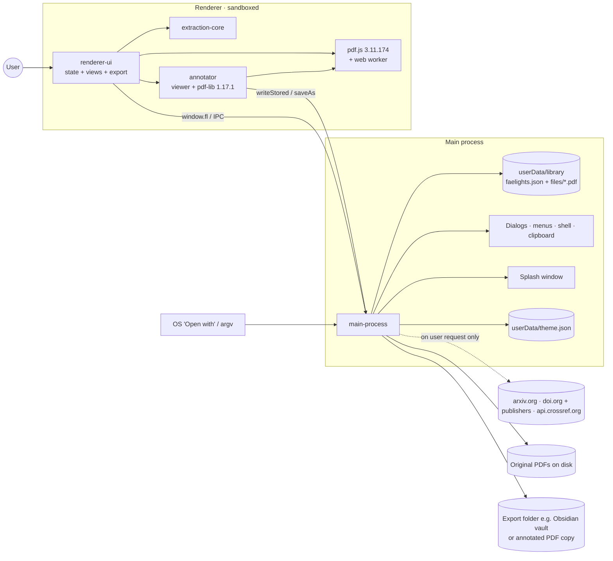

# Faelights — Project Compass
> Last updated: 2026-10-10 · Last logged commit: b146661 · Version: 1.2.1 (tag `v1.2.1`, draft GitHub Release)

## 1. Snapshot
Faelights is a local-first desktop app (Electron, Windows/macOS/Linux) that pulls highlights, underlines and strike-throughs out of annotated PDFs. It shows them in reading order, grouped by topic, and keeps PDFs in libraries that can be tagged, starred, searched and exported to Markdown, Obsidian or plain text. It is aimed at people who read and annotate PDFs (students, researchers) and want their highlights in a notes tool such as Obsidian or Notion (audience inferred from README; unverified). Status: v1.0.0 shipped in the initial commit (2026-10-08). Since then, unreleased work on `main` has added smarter topic fallbacks with an "Abstract" group (F-002), brand icons, logo and a splash screen (F-003), a light/dark/system theme toggle (F-004), and resizable, collapsible columns with slimmer scrollbars (F-005), and a Zotero-style PDF info panel above the extracts (F-006). All of it is merged to `main` and pushed to GitHub (2026-10-09), but no new version has been tagged. It now also has an in-app PDF viewer and annotator (F-007, merged 2026-10-09), which reverses the earlier "no annotating inside the app" non-goal. A brand refresh (F-008: dot-ring mark, new app icon and favicons, animated splash) was merged to `main` on 2026-10-09. Also added: a "View" button beside Info that opens the annotator, and a "My publications" sidebar section (F-009). Everything up to F-009 is pushed to GitHub. Sprint 1 of a tech-lead run (2026-10-09) then merged three more features into `main` (pushed 2026-10-09): a themed in-app action menu with ⋯ buttons for libraries and PDFs (F-010); adding PDFs by DOI, arXiv ID, PubMed Central ID or link, the app's first and only network use, which happens only when the user asks for it, so the app still works fully offline (F-011, D-009); and an `npm test` harness with extraction snapshot tests (F-012). A follow-up fix put Add PDFs buttons in the PDF list header and left-aligned the reader toolbar (F-013, pushed). Sprint 2 (2026-10-09) added: an "Add by identifier" box that also takes ISBNs, PMIDs and ADS Bibcodes, several at once (F-014); image capture, where the user boxes a figure in the viewer and it shows up centred among the extracts in PDF order under a "With images" toggle (F-015); and more export formats (HTML) with images (F-016). A polish pass (F-017) labelled the reader's info button "Metadata" and resized the app icon so it matches other apps on the Windows taskbar. The installed Windows app now shows the Faelights icon in the Start menu and on shortcuts instead of Electron's (F-018). Sprint 3 (2026-10-09) added copying a captured image to the clipboard (F-019) and looking up a paper's details (title, authors, journal, abstract…) from CrossRef or arXiv, automatically after adding by DOI/arXiv and on demand from the Info card (F-020). Everything through F-020 was pushed to GitHub on 2026-10-10 and released as **v1.2.1** (the v1.2.0 tag's CI run failed, see F-021): tagging a version now builds the installers in CI and attaches them to a draft GitHub Release, which the user publishes by hand (F-021). Next: pick Sprint 4 from the proposals on the tech-lead board.

## 2. Vision & scope
- **Goals:**
  - Reliable extraction of every markup annotation, with its page, colour and note.
  - Context in two views: *Full sentence* or *Highlights only*.
  - Topic grouping from bookmarks, falling back to headings by font size, then by wording, then by page, so every PDF is navigable.
  - Organisation through libraries, tags and stars, plus search across every PDF.
  - Clean export into personal knowledge tools, especially an Obsidian vault.
  - Highlights survive the original PDF moving or being deleted.
- **Non-goals:**
  - Cloud sync, accounts or any background network service. ~~Nothing in the code makes network calls.~~ Revised 2026-10-09: the app may go online only when the user explicitly asks (add a paper by DOI/arXiv/link, F-011; paper details lookup, F-020). It must keep working fully offline, and nothing runs in the background (→ D-009).
  - ~~Annotating or editing PDFs inside the app.~~ Revised 2026-10-09: annotating is now in scope (F-007), including image-capture boxes (F-015). Editing page content (text, images, page order) is still out of scope, and the user's original PDF is still never written.
  - OCR. Marks over scanned pages are listed as "loose" and the user is told to OCR the file outside the app.
- **Success criteria (unverified):** highlights from common readers (Acrobat, Preview, Zotero and similar) extract correctly; exports drop into Obsidian without cleanup.

## 3. Architecture
### Diagram


### Components
| Component | Responsibility | Tech | Atlas link |
|---|---|---|---|
| Main process | Storage, file copies, dialogs, menus, OS integration | Electron main, Node fs | [main-process](atlas/modules/main-process.md) |
| Preload bridge | Narrow `window.fl` API from renderer to main | `contextBridge` | [preload-bridge](atlas/modules/preload-bridge.md) |
| Extraction core | PDF text stream, annotation hit-testing, sentence and topic grouping | Plain JS over pdf.js | [extraction-core](atlas/modules/extraction-core.md) |
| Renderer UI | Three-pane UI, search, export formatting | Vanilla JS + CSS, no framework | [renderer-ui](atlas/modules/renderer-ui.md) |
| Annotator | In-app PDF viewer; writes highlight/underline/strike/note/ink annotations into the library copy | pdf.js render + text layer, pdf-lib | [annotator](atlas/modules/annotator.md) |
| Packaging | Installers and CI builds | electron-builder, GitHub Actions | [packaging](atlas/modules/packaging.md) |
| Tests | Extraction snapshot and identifier-parsing tests | node:test (built-in) | [tests](atlas/modules/tests.md) |

### Tech stack
| Layer | Choice | Version | Why chosen |
|---|---|---|---|
| Shell | Electron | ^31 | Cross-platform desktop with filesystem access (→ D-001) |
| PDF parsing | pdfjs-dist | 3.11.174 (pinned) | Exposes text content and annotation geometry (→ D-003) |
| PDF writing | pdf-lib | 1.17.1 (pinned) | Pure-JS UMD build, no `eval` (CSP-safe), low-level object access to add/remove annotations (→ D-008) |
| UI | Vanilla JS / DOM, immediate-mode re-render | — | No build step (→ D-004) |
| Storage | Single JSON file + copied PDFs | — | Local-first, inspectable (→ D-002) |
| Fonts | @fontsource Figtree, Newsreader, Young Serif | ^5 | Bundled offline fonts |
| Packaging | electron-builder | ^24.13.3 | NSIS/zip, dmg, AppImage |
| CI | GitHub Actions | — | Matrix build per OS |

### Data model (high level)
- **Library:** a named container. `inbox` is a built-in system library that can't be deleted.
- **Doc:** one imported PDF. It belongs to exactly one library and carries tags, a star, its original path, the path of its stored copy, the last-scanned mtime, and the cached extraction `result`. An `annotated` flag marks docs edited in the annotator: their stored copy becomes the source of truth and the original is no longer followed (→ D-008).
- **Result:** entries (sentence + highlighted spans + topic), loose marks, and topics. It is cached so the UI never re-parses the PDF unless a rescan is triggered.
- **Settings:** view mode, export format, list sort and column layout (widths + hidden state per column) in the DB. The theme is stored separately in `theme.json`, owned by the main process (→ D-005).

### Key flows
- **Add:** the PDF is copied into the library, analysed in the renderer, and its result is saved into the JSON DB.
- **Sync on change:** at startup the original's mtime is compared with the last scan. Docs that have changed show as "Changed" and rescan automatically when opened. When the original is missing, the stored copy is used and the user is offered "Find original file".
- **Startup:** a splash window shows the logo while the main window loads, and is swapped out once the library has rendered (→ D-006).
- **Search:** in-memory AND-match over sentence, highlight, note and topic text across all cached results.
- **Export:** one note per PDF, with optional YAML frontmatter, written to a file or to a folder per library.
- **Annotate:** open a doc in the viewer, mark text or draw; each change is written into the library copy immediately; leaving the viewer re-extracts so new highlights and notes show up as extracts. "Download PDF" saves the annotated file anywhere.

## 4. External services & integrations
| Service | Purpose | Where configured | Env var NAMES | Limits / cost | If it fails… |
|---|---|---|---|---|---|
| GitHub Actions | Build installers on `v*` tags | `.github/workflows/build.yml` | none | Free tier minutes | No installers. Build locally with `npm run dist:*`. |
| OS shell / file associations | "Open with" for `.pdf`, open/reveal files | `package.json build.fileAssociations` | none | — | Users add PDFs from inside the app instead |

| arXiv, doi.org (+ publisher sites), CrossRef REST API | Download a paper's PDF when the user adds it by arXiv ID, DOI or link (F-011) | `src/main.js` `pdf:fetch` | none | No key; public endpoints. Limits: 150 MB per PDF, 15 s to first response, 30 s stall | Clear in-app message: offline, paywalled (with "Open in browser"), not a PDF, not found. Adding from disk is unaffected. |
| NCBI ID converter + E-utilities, PubMed Central | PMID → PMC copy or DOI (F-014) | `src/main.js` `resolvePdf` | none | No key; public endpoints. PMC currently serves a bot-check page to non-browser clients | Falls back to the DOI path; else "No free PDF was found" |
| ADS link gateway (ui.adsabs.harvard.edu) | ADS Bibcode → e-print / publisher / ADS scan PDF (F-014) | `src/main.js` `resolvePdf` | none | No API token needed for the gateway | "Paywalled" with Open in browser |
| CrossRef REST API (`works/<doi>`), arXiv API (`export.arxiv.org/api/query`) | Paper details for the Info card (F-020) | `src/main.js` `meta:lookup`, parsed by `src/metadata.js` | none | No key; public endpoints. 20 s cap per lookup | Info card keeps the PDF's own fields; toast says offline / no record / couldn't reach. Already-fetched details stay (stored in the library) |
| Open Library search + Internet Archive downloads | ISBN → free public-domain scan (F-014) | `src/main.js` `resolvePdf` | none | Only `ebook_access: public` scans; books can be large; scan may be another edition | "No free PDF was found" with Open in browser / Add from file |

There are no analytics or telemetry, and no background network calls: requests happen only inside the add-by-identifier dialog after the user submits it, and for a details lookup right after such an add or when the user clicks Look up details (→ D-009). Fetches use a separate in-memory session so publisher cookies don't persist. The app reads no environment variables.

## 5. Environments & deployment
| Env | Target | Branch | How it deploys | Notes |
|---|---|---|---|---|
| Local dev | `npm start` | any | manual | Node 18+ |
| CI check | Run artifacts (kept 7 days) | `main`, pull requests | push / PR → tests + all three builds | Catches a broken build before release (added after the v1.2.0 failure). |
| Release builds | Draft GitHub Release (+ run artifacts) | tag `v*` | push tag → matrix build → `softprops/action-gh-release` attaches files to a draft release | electron-builder runs with `--publish never`; the workflow's release step uploads instead. The user reviews and publishes the draft. |

- **CI/CD:** on every push to `main`, every PR and every `v*` tag: checkout → Node 22 (npm cache) → strict `npm ci` → `npm test` → (tags only) check the tag equals `v` + package.json version → `electron-builder` per OS → upload `.exe/.zip/.dmg/.AppImage` as artifacts and, on tags, to a draft GitHub Release (`contents: write` permission).
- **Releasing:** bump `version` in `package.json` on a branch, merge to `main`, push, **wait for the `main` build to go green**, then push the matching `v<version>` tag (a mismatched tag fails the run).
- **Code signing:** none. Windows `signAndEditExecutable: false`, so an `afterPack` hook writes the icon into the exe instead (→ D-014); macOS is not notarised, so Gatekeeper will warn (unverified).
- **Data migrations:** none. `loadDb` only adds a missing Inbox and missing settings defaults. The DB has `version: 1`, but nothing reads it yet.
- **Rollback:** reinstall the previous installer. User data in `userData/library` is untouched by install and uninstall (unverified for the NSIS uninstaller).
- **Secrets:** none.
- **App icon:** the brand mark on a dark rounded tile (F-003; redrawn with the dot-ring mark in F-008; margin cut to ~2% in F-017). Windows uses the multi-size `build/icon.ico`, mac and Linux use `build/icon.png`, through `directories.buildResources: build`.
- **Local Windows build note:** on this machine (Node 26), `electron`'s postinstall did not extract its binary, so it was unzipped by hand. Build with `npx electron-builder --win --config.electronDist=node_modules/electron/dist` to avoid re-downloading Electron.

## 6. UI & UX
- **Design system:** CSS custom properties in `renderer/styles.css`, with a light palette (lavender-grey background, amber accent `#B8721A`, glow `#F4B23E`) and a dark palette through `prefers-color-scheme`. The user picks System, Light or Dark (F-004), which sets the media query app-wide. Fonts: Young Serif for display, Figtree for UI, Newsreader for reading text. Highlight marks use the PDF annotation's own colour at reduced alpha.
- **Brand:** a lowercase "faelights" wordmark (Young Serif) next to the **mark** (a ring of small dots with one glowing mote; until F-008 it was a highlight stroke plus a mote). The **mote** alone is used for small accents. Every asset has light and dark variants in `renderer/assets/brand/`. The app icon is the mark on a dark rounded tile.
- **Screen map:**
  ```
  Window (3-pane grid; every column resizable by drag and hideable to a slim labelled strip)
  Splash (frameless 440×280): animated lockup (dots appear, mote blooms, wordmark writes in) + "Gathering your highlights…"
  ├── Sidebar: brand (mark + wordmark) · Add PDFs · Search / All PDFs / Starred / My publications · Libraries (+ new) · Tags · footer (stale count, Rescan · theme icon switch)
  ├── List: view title · filter box · sort · progress meter · PDF cards (marks, pages, colour swatches, Changed / Original moved)
  └── Reader: title (click to rename) · open-in-app · ⋯ · library/star/tags · View (opens the annotator) · Info toggle · Full/Only toggle · With images (only when the PDF has image boxes) · format select · Copy · Export ▾ (Markdown / Obsidian / HTML / Plain text · Include images)
               ├── Rail (own scroll, resizable, hideable): colour filter chips · Topics TOC
               ├── Info card (when toggled on): Zotero-style fields (type, title, authors, abstract, publication, DOI/arXiv links…) + File details
               └── Groups by topic → extracts (page → opens viewer at that page, quote, notes, copy-one) and, with "With images", centred figures (crop, p. N, note) placed before the fact they sit in
  Annotator (replaces the reader while open): ← Highlights · title · page box · zoom −/%/+/fit · undo/redo · Download PDF
               tools: Select · Highlight · Underline · Strike · Note · Draw · Capture image  +  5 colour swatches · save status
               pages (continuous scroll, lazy-rendered) · popovers: selection (colours, underline, strike, note, copy) / mark (recolour, note, delete) / note editor
  Search view (list pane hidden): query · library scope · mode toggle → results by PDF, click to jump
  Empty states: mote + onboarding with "Try a sample PDF" + shortcut legend
  Topics: extracts before the first topic sit under "Abstract"
  ```
- **State:** one global state object, re-rendered fully on each change. Persistence is debounced (250 ms) and saves the whole DB.
- **Interaction:** a themed in-app action menu for libraries and PDFs (F-010), opened by right-click, a ⋯ button on hover/focus/current row, or Shift+F10 / the ContextMenu key, with icons, groups, red destructive items last, and shortcut hints only where they work; "Add by identifier" dialog (link button next to Add PDFs, File menu Ctrl/⌘+Shift+O, Ctrl/⌘+V of identifiers or links outside text fields, or dropping links) with a multi-line box for ISBNs, DOIs, PMIDs, arXiv IDs, ADS Bibcodes and links, a live "recognised as…" / "N recognised" hint, a status row per item in a batch, and an "Offline" pill (F-011, F-014); drag PDFs from the OS onto the window or onto a library, drag docs between libraries, keyboard (↑↓/J K, Delete, Ctrl/⌘ shortcuts from the app menu).
- **Accessibility:** ARIA labels on icon buttons and inputs, `aria-current`/`aria-pressed` states, `:focus-visible` outlines, and a `role=status` toast.
- **Layout:** the sidebar, PDF list and topics rail can each be resized by dragging the handle at their right edge and hidden with a panel button (or Ctrl+B / Ctrl+Shift+B / Ctrl+Alt+B, View menu). A hidden column becomes a 34 px strip with a vertical label that reopens it. Dragging below the minimum snaps the column shut. Double-click a handle to reset it; View → Reset Column Widths resets all. Handles are focusable separators (←/→ resize, Enter toggles).
- **Scrollbars:** slim rounded thumbs in the muted tone that firm up when their pane is hovered and turn accent while dragged.
- **Responsive:** minimum window 900×560. On narrow windows the list, then the sidebar, give up width so the reader keeps at least 420 px; the topics rail hides when the reader is under 600 px.
- **Motion:** the brand SVGs pulse; the splash lockup animates in over ~2.2 s and the splash stays up at least 2.3 s so it finishes. All of it stops under `prefers-reduced-motion`.
- **Image boxes (F-015):** a 1.5 pt coloured outline with no fill, so the page under it stays visible; text inside stays selectable (only the border picks the box). Image colours join the reader's colour filter.
- **Annotator keys:** V/H/U/S/N/D/I pick tools, Ctrl+Z / Ctrl+Shift+Z (or Ctrl+Y) undo/redo, Delete removes the selected mark, +/−/0 zoom and fit, Esc steps back (popover → selection → tool → leave viewer). While the viewer is open the list shortcuts (↑↓ J K, Delete) are disabled. Page canvases stay white in dark mode.

## 7. Feature log (newest first)
### F-021 · Draft GitHub Releases from CI; v1.2.1 · 2026-10-10 · shipped (tag v1.2.1)
- **Why:** installers were only downloadable from a workflow run's artifacts; the user wanted proper releases.
- **How:** on a `v*` tag the build workflow now also attaches the installers to a draft GitHub Release (`softprops/action-gh-release`, `contents: write`). Drafts let the user check the files before publishing. Version bumped 1.0.0 → 1.1.0 on that branch (never released), then to 1.2.0 for the first tagged release, at the user's choice.
- **Touched:** [packaging](atlas/modules/packaging.md)
- **Added:** release step in `.github/workflows/build.yml`. No app code.
- **Trade-offs:** installers are still unsigned (OS warnings remain); publishing stays a manual click.
- **Revised 2026-10-10:** the first run (tag v1.2.0) failed: electron-builder tried to recompile `canvas`, an optional dependency of pdfjs-dist the app never ships, for Electron, and there is no prebuilt binary (Linux lacked pixman, Windows lacked a usable Visual Studio). Fixed with `npmRebuild: false` (the app has no native modules) and matrix `fail-fast: false`; released as v1.2.1 instead, leaving the v1.2.0 tag in place.
- **Commit range:** `ci/github-releases` (71b60e5), merged at b146661; version bump on `chore/release-1.2.0`; fix on `bug/ci-skip-native-rebuild`

### F-020 · Paper details from CrossRef and arXiv (meta-enrich) · 2026-10-09 · shipped (736ffd2, pushed 2026-10-10, in v1.2.0)
- **Why:** PDFs often carry little or wrong metadata; the Info card should show the real title, authors, journal, date and abstract (todo T-001, planned since Sprint 1).
- **How:** a DOI is looked up on CrossRef, an arXiv id (or arXiv's own 10.48550 DOI) on the arXiv API. A new pure module maps both responses to the same fields the PDF reader already produces, plus an item type. Lookups run in the main process with their own cancel signal and a 20 s cap, so they never interfere with a PDF download. Runs by itself in the background after adding a paper by DOI/arXiv/link, and on demand via "Look up details" / "Refresh details" on the Info card, which also says where the details came from and when.
- **Touched:** [main-process](atlas/modules/main-process.md), [preload-bridge](atlas/modules/preload-bridge.md), [renderer-ui](atlas/modules/renderer-ui.md), [tests](atlas/modules/tests.md)
- **Added:** `src/metadata.js`, `meta:lookup` IPC, doc fields `lookup` and `titleEdited`, `test/metadata.test.js` (tests 63 → 69). No dependencies.
- **Trade-offs:** online details are stored next to the PDF's own metadata, not merged into it (→ D-013). Offline fails at once with a clear message (D-009). A looked-up title replaces the doc title only when the PDF had none and the user hasn't renamed it. Not yet used in exports.
- **Known limits / follow-ups:** papers with neither DOI nor arXiv id can't be looked up; exports and search don't use the looked-up fields; alternate open-access locations (T-003) could reuse this lookup.
- **Commit range:** `feature/T-001-meta-enrich` (6d15763), merged via `feature/s3-integration` (269424f → main 736ffd2)

### F-019 · Copy a captured image to the clipboard · 2026-10-09 · shipped (736ffd2, pushed 2026-10-10, in v1.2.0)
- **Why:** the user wanted to paste a captured figure straight into Word, Paint or Obsidian (todo T-012).
- **How:** each image in the reader's "With images" view has a Copy button and a right-click menu (Copy image / Show page). The PNG already rendered for the reader goes to the main process, which puts it on the clipboard as an image; a toast confirms.
- **Touched:** [renderer-ui](atlas/modules/renderer-ui.md), [preload-bridge](atlas/modules/preload-bridge.md), [main-process](atlas/modules/main-process.md)
- **Added:** `clip:image` IPC. No dependencies.
- **Trade-offs:** copies at the reader's render scale (2×, capped at 2400 px), the same as export, rather than re-rendering larger.
- **Commit range:** `enhancement/T-012-copy-image` (5c143c7), merged via `feature/s3-integration` (9d8820f → main 736ffd2)

### F-018 · Faelights icon on the installed Windows app · 2026-10-09 · shipped (eb99c96, pushed 2026-10-10, in v1.2.0)
- **Why:** after installing, the Start menu and shortcuts showed Electron's atom icon (user report, todo T-013).
- **How:** the Windows build has `signAndEditExecutable: false`, which also skips writing the icon into the exe. Removing it breaks local builds (electron-builder's signing-tools archive needs symlink rights on Windows), so an `afterPack` hook now writes `build/icon.ico` into the exe with `rcedit`. Verified by building the installer and extracting the exe's icon.
- **Touched:** [packaging](atlas/modules/packaging.md)
- **Added:** `scripts/set-exe-icon.js`, devDependency `rcedit`.
- **Trade-offs:** → D-014. Windows may show a cached old icon until sign-out.
- **Commit range:** `bug/T-013-installed-app-icon` (71571a8), merged to main eb99c96

### F-017 · "Metadata" label on the info button; taskbar-sized app icon · 2026-10-09 · shipped (f541b3f, pushed 2026-10-10, in v1.2.0)
- **Why:** the user asked for a text label next to the reader's ⓘ button, and reported that the Faelights icon looked smaller than other apps' icons on the Windows taskbar.
- **How:** the ⓘ button now reads "Metadata", like the View button beside it. The icon tile used only 87.5% of its canvas and Windows was scaling a single 256 px PNG down to 24/32 px; the tile now fills ~96% (100% at 16–24 px), and a multi-size `.ico` (16–256 px, each frame rendered separately) is used for the window on Windows and for the Windows build. Rendered with a throwaway Electron canvas script, no new dependency.
- **Touched:** [renderer-ui](atlas/modules/renderer-ui.md), [main-process](atlas/modules/main-process.md), [packaging](atlas/modules/packaging.md)
- **Added:** `build/icon.ico`, `renderer/assets/brand/app-icon.ico`. No dependencies.
- **Trade-offs:** when running from source, a pinned taskbar shortcut can still show Electron's own icon; the window and installed app use the new one. The card the button opens is still headed "Info".
- **Commit range:** `fix/taskbar-icon-size` (055a74f), `feature/metadata-label` (47e8eeb), merged via `feature/polish-integration` (f541b3f)

### F-016 · More export formats, with images · 2026-10-09 · shipped (40bb2c7, pushed 2026-10-10, in v1.2.0)
- **Why:** captured images (F-015) needed to leave the app with the text, and an HTML export was requested alongside Markdown/Obsidian/plain.
- **How:** Export became a menu (Markdown, Obsidian, HTML, Plain text, plus an "Include images" check bound to the reader's With images setting). With images on, crops are rendered as PNGs and written to a `<file name> images/` folder next to the export (library export: one folder per doc), linked inline in reading order; HTML is a single self-contained file with images embedded. Copy inserts `[Image, p. N]` placeholders. Formatting moved into a pure, tested module; main validates every renderer-supplied path before writing.
- **Touched:** [renderer-ui](atlas/modules/renderer-ui.md), [main-process](atlas/modules/main-process.md), [preload-bridge](atlas/modules/preload-bridge.md), [tests](atlas/modules/tests.md)
- **Added:** `renderer/exportfmt.js`, `src/exportPaths.js`; IPC `export:bundle`, `export:folder` assets; setting `fmt: html`; `test/export.test.js`. No dependencies.
- **Trade-offs:** the export text is built before the save dialog, so a placeholder token stands for the images folder and main swaps in the real name (→ D-012). Exports include all images regardless of the colour filter (Copy honours it). Without images, md/obsidian/plain output is byte-identical to before (tested).
- **Known limits / follow-ups:** many large crops take a few seconds (progress toast); no per-export image resolution choice.
- **Commit range:** branch `feature/s2-image-export` (25a74e3), merged in d62427f on `feature/s2-integration`

### F-015 · Image capture: boxes in the viewer, images among the extracts · 2026-10-09 · shipped (40bb2c7, pushed 2026-10-10, in v1.2.0)
- **Why:** figures and tables matter as much as highlighted sentences; the user wanted to mark them and see them in context.
- **How:** a "Capture image" tool (I) draws a border-only PDF Square annotation in the highlight palette (recolour, note, delete, undo like other marks). Extraction reads every Square into `result.images` with a reading-order position; an image that falls inside a fact is placed before it. A "With images" reader toggle interleaves centred crops (rendered from the stored PDF with annotations hidden, cached per doc version) in both Full sentence and Highlights only, grouped under their topic; image colours join the colour filter. `ANALYZER_VERSION` → 3, so saved docs rescan on open.
- **Touched:** [annotator](atlas/modules/annotator.md), [extraction-core](atlas/modules/extraction-core.md), [renderer-ui](atlas/modules/renderer-ui.md), [tests](atlas/modules/tests.md)
- **Added:** `renderer/images.js` (crop helper), `renderer/order.js` (shared placement rule); setting `images`; fixture `test/fixtures/images.pdf` + generator; `test/images.test.js`, `test/reader-images.test.js`. No dependencies.
- **Trade-offs:** boxes are standard Square annotations (→ D-011), so they show in every PDF reader and Squares from other apps (e.g. Zotero image annotations) count as images too. Colour "sorting" means the existing colour filter, per the user, not a group-by-colour view.
- **Known limits / follow-ups:** boxes can't be moved or resized (delete and redraw); with the toggle off, image colours don't appear in the chips.
- **Commit range:** branches `feature/s2-image-box` (55ff131), `feature/s2-image-extract` (f8cee1d), `feature/s2-image-view` (d71ad69), merged in 7963874, 207c7d7, 96051c7 on `feature/s2-integration`

### F-014 · Add by identifier (ISBN, DOI, PMID, arXiv, ADS Bibcode, links), several at once · 2026-10-09 · shipped (40bb2c7, pushed 2026-10-10, in v1.2.0)
- **Why:** the user wanted the add box to work like Zotero's "Enter ISBNs, DOIs, PMIDs, arXiv IDs, or ADS Bibcodes".
- **How:** the dialog became "Add by identifier" with a multi-line box; a pasted list is split, each item recognised and fetched one at a time with its own status row. New resolvers in main: PMID → NCBI ID converter → PMC copy or DOI (PubMed summary as DOI fallback); ADS → arXiv for arXiv bibcodes, else the ADS link gateway (e-print, publisher, ADS scan); ISBN → a free public-domain scan from Open Library / Internet Archive, else a clear "no free PDF" with Open in browser and Add from file.
- **Touched:** [main-process](atlas/modules/main-process.md), [preload-bridge](atlas/modules/preload-bridge.md), [renderer-ui](atlas/modules/renderer-ui.md), [tests](atlas/modules/tests.md)
- **Added:** IPC `id:parseMany`; failure reason `no-free-copy`; `origin.kind` `pmid|isbn|ads`; File menu item renamed "Add by Identifier…". New public endpoints (see §4). No dependencies, no env vars.
- **Trade-offs:** ISBNs only download genuinely free scans, no placeholder book entries (user decision); bare numbers of 6–8 digits are PMIDs, shorter ones need a `PMID:` prefix; batches run serially because main has one fetch controller.
- **Known limits / follow-ups:** PMC bot-walls non-browser clients, so PMC/PMID downloads can fail; an ISBN can fetch another edition's scan; resolvers were checked with plain Node, not through Electron's network stack.
- **Commit range:** branch `feature/s2-add-ids` (49ffd4c), merged in 96e2507 on `feature/s2-integration`; sprint merged to `main` in 40bb2c7

### F-013 · Add PDFs from the list header; left-aligned reader toolbar · 2026-10-09 · shipped (e4be24f, pushed)
- **Why:** once a library had PDFs, the only add buttons were in the sidebar, which can be hidden. The reader toolbar also started at the right edge, away from the meta row above it.
- **How:** the PDF list header gets icon buttons for "Add PDFs" and "Add from DOI or link" beside the hide-pane button, in every view. The reader toolbar's leading spacer was removed, so View, Info, the mode switch, format, Copy and Export start from the left.
- **Touched:** [renderer-ui](atlas/modules/renderer-ui.md)
- **Added:** CSS class `.head-acts`; removed `.r-tools .sp`. No IPC, dependencies or data changes.
- **Verified:** `npm test` 23/23 on the branch and on `main`; the user checked it in the running app on the branch (gate 1) and on `main` (gate 2).
- **Commit range:** 9a24fec (branch `fix/list-add-and-reader-tools`), merged in e4be24f

### F-012 · Test harness and extraction snapshot tests · 2026-10-09 · shipped (c6748e9, pushed)
- **Why:** there were no automated tests, so merges (especially parallel ones) were checked blind.
- **How:** `npm test` runs Node's built-in test runner over `test/**/*.test.js`, with no new dependencies. A helper loads PDFs in Node through pdf.js's legacy build. `core.test.js` snapshots `analyzePdf` on `renderer/sample.pdf` (pages, marks, every entry, topics, analyzer version, known phrases).
- **Touched:** [tests](atlas/modules/tests.md), [packaging](atlas/modules/packaging.md)
- **Added:** `npm test` script; `test/` folder.
- **Trade-offs:** snapshot values are exact, so any intended extraction change must update the test. Node ≥ 21 is needed for the glob.
- **Verified:** 7/7 pass; deliberately dropping an entry in `core.js` failed 4 of 7.
- **Known limits / follow-ups:** the sample covers only highlights and font-size headings; underline/strike/squiggly, outline and wording-based topics and loose marks need a second fixture. Not yet run in CI.
- **Commit range:** 9d85bfa (branch `test/s1-test-harness`), merged in c6748e9

### F-011 · Add PDFs by DOI, arXiv ID or link (offline-safe) · 2026-10-09 · shipped (c5c0dbe, pushed)
- **Why:** papers are usually found as a DOI or a link, not a file on disk; the user wanted to add them directly instead of downloading by hand first.
- **How:**
  - A dialog (link button beside Add PDFs, File menu, paste, or link drop) recognises DOIs, arXiv IDs (new and old), PubMed Central IDs and http(s) links as you type.
  - The main process downloads: arXiv from arxiv.org; DOIs through doi.org to the publisher page and its `citation_pdf_url`, falling back to CrossRef's full-text links; other links directly or via their page's PDF link. The bytes must start with `%PDF-`. The file is then imported like a disk file, and the temp copy is deleted.
  - These docs have no original on disk (like the sample) and remember where they came from (`origin`). Adding the same paper twice opens the existing one.
  - Offline: the dialog fails immediately with a friendly message, keeps the input, and offers "Add PDFs from file…". Paywalled or bot-blocked papers offer "Open in browser".
- **Touched:** [main-process](atlas/modules/main-process.md), [preload-bridge](atlas/modules/preload-bridge.md), [renderer-ui](atlas/modules/renderer-ui.md), [tests](atlas/modules/tests.md)
- **Added:** `src/identify.js`; IPC `id:parse`, `pdf:fetch`, `pdf:fetchCancel`, `app:openExternal`, `clip:read`, push `fetch-progress`; File menu "Add from DOI or Link…"; optional doc field `origin` (no migration). External endpoints arxiv.org, doi.org, api.crossref.org. No new dependencies.
- **Trade-offs:** first network use in the app, limited to explicit user action (→ D-009). Uses `net.request` (Chromium stack, system proxy) rather than `net.fetch` (→ D-010). Without an Unpaywall key, open-access copies hosted elsewhere aren't found. The landing page's title is used only when the PDF has none.
- **Verified:** 16 unit tests; live: arXiv ID and arXiv DOI imported "Attention Is All You Need"; a PLOS DOI and a direct PLOS PDF imported; `10.1038/nature14539` failed cleanly; invalid and `javascript:` input rejected; simulated offline (DNS blocked and `navigator.onLine` false) failed fast while disk add still worked. Not verified live: OS "Open with", real Ctrl+Shift+O keypress.
- **Known limits / follow-ups:** a mistyped hostname reports "offline" (DNS failure is treated as offline); nature.com serves a bot challenge to Chromium, so some open-access DOIs fail; no metadata lookup yet (Sprint 2: meta-enrich).
- **Commit range:** 1df4dc9..3c94833 (branch `feature/s1-add-by-identifier`), merged in c5c0dbe

### F-010 · Themed item action menu · 2026-10-09 · shipped (f576105, pushed)
- **Why:** library and PDF actions were plain native OS menus, only reachable by right-click, and didn't match the app's look.
- **How:** a reusable in-app popover menu replaces the native popup for the library menu, the PDF menu and the reader's library picker. Items have icons, groups, a red style for destructive actions (listed last), ✓ for checked items, submenus (Move to), and shortcut hints only where the shortcut applies. A ⋯ button appears on library rows and PDF cards on hover, focus or when current; right-click, Shift+F10 and the ContextMenu key open the same menu. Full keyboard support and ARIA menu roles.
- **Touched:** [renderer-ui](atlas/modules/renderer-ui.md)
- **Added:** no dependencies or IPC. The native `menu:popup` channel is now unused but kept.
- **Trade-offs:** chosen over a hover action bar or a command palette (user decision, 2026-10-09). Rows were restructured into wrappers because buttons can't nest, keeping drag-and-drop and click behaviour.
- **Verified:** 39/39 scripted checks over DevTools Protocol in an isolated profile, light and dark screenshots; user tried it in the combined build before merge. Dialog-opening actions were checked by stubbing, not clicked for real.
- **Known limits / follow-ups:** the PDF menu still says "Annotate" while the reader button says "View".
- **Commit range:** 338ae82 (branch `feature/s1-item-actions`, plus merge of main 4cab30c), merged in f576105

### F-009 · "My publications" section · 2026-10-09 · shipped (merged to main from `feature/my-publications`)
- **Why:** the user wanted a sidebar section for their own papers, under Starred.
- **How:** a `mine` flag on each doc, working like the star. "My publications" sits in the sidebar under Starred, with a count, and shows only those docs. A PDF is marked from a reader-header toggle ("Mark as mine" / "My publication"), from its ⋯ menu, or by dragging it onto the sidebar item. The section has its own empty state.
- **Touched:** [renderer-ui](atlas/modules/renderer-ui.md)
- **Added:** doc field `mine`; view kind `mine`. No dependency, IPC or migration (a missing field reads as false).
- **Trade-offs:** a flag rather than a library, so a paper can stay in a topic library and also be listed as yours. It isn't detected from metadata (author names); the user marks papers by hand.
- **Verified:** over DevTools Protocol: sidebar item and count, empty state, mark and unmark from the reader toggle, filtered list.
- **Known limits / follow-ups:** no bulk marking; not yet a search scope or an export filter.

### F-008 · Brand refresh: dot-ring mark, app icon and animated splash · 2026-10-09 · shipped (merged to main b9848fb)
- **Why:** the user supplied new brand files: a mark redrawn as a ring of dots around a glowing mote, matching favicons, and an animated splash lockup.
- **How:**
  - The new mark and favicons (light and dark) replace the old ones under the same file names, so the sidebar, favicons and the `<picture>` wiring needed no code changes.
  - The splash page now shows the designer's animated SVG lockup (mark plus outlined wordmark) in place of the HTML mark and Young Serif text.
  - `SPLASH_MIN_MS` went from 900 ms to 2.3 s, so the wordmark finishes writing in before the main window takes over.
  - Both app icon PNGs (1024 px for builds, 256 px for the window) were redrawn from the new dark mark on the same `#1F1C2A` rounded tile, with a throwaway Electron canvas script (no new dependency).
- **Touched:** [renderer-ui](atlas/modules/renderer-ui.md), [main-process](atlas/modules/main-process.md), [packaging](atlas/modules/packaging.md)
- **Added:** `renderer/assets/brand/splash-light|dark.svg`.
- **Trade-offs:** every launch now takes at least 2.3 s. The splash SVG fades itself out between 2.9 and 4 s, so a slow library load leaves only the "Gathering…" line on screen. The mote files sent with the update were unchanged and were not replaced.
- **Commit range:** c6424a0
### F-007 · PDF viewer and annotator · 2026-10-09 · shipped (merged to main from `feature/pdf-annotator`)
- **Why:** the user wanted to view PDFs and add annotations inside Faelights, then export or download the annotated PDF, rather than switching to another reader to highlight.
- **How:**
  - A viewer replaces the reader pane: pdf.js draws each page to a canvas (existing annotations included) with a selectable text layer. Pages render lazily as they scroll into view, and are dropped again when far away.
  - Tools: Highlight, Underline, Strike through (from a text selection), Note (a sticky note placed on the page), Draw (freehand ink), and Select (a popover on selected text; clicking a mark lets you recolour it, add or edit its note, or delete it). There are five colours.
  - Edits are written as real PDF annotations with pdf-lib, each with its own appearance stream so other readers draw them too. Quads cover the text box so extraction-core's hit test picks up new marks; a note on a highlight becomes the extract's note.
  - Each edit saves the whole PDF and reloads it, so undo/redo is a stack of byte snapshots (up to 40). The bytes are written to the library's copy straight away (atomic write), so nothing can be left unsaved. Leaving the viewer rescans the doc.
  - "Download PDF" (viewer) and "Save PDF copy… / Save annotated PDF…" (doc menu) write the PDF wherever the user picks. "Discard annotations made here…" restores the original file.
- **Touched:** [annotator](atlas/modules/annotator.md) (new), [renderer-ui](atlas/modules/renderer-ui.md), [main-process](atlas/modules/main-process.md), [preload-bridge](atlas/modules/preload-bridge.md), [packaging](atlas/modules/packaging.md)
- **Added:** dependency `pdf-lib` 1.17.1 (shipped through `build.files`); IPC `pdf:writeStored`, `pdf:saveAs`; doc fields `annotated`, `annotatedAt`; setting `settings.annotColor`; "Annotated" list pill; doc menu items; clickable page numbers on extracts. No migration: missing fields read as false/default.
- **Trade-offs:** annotations go into the library copy, never the original (keeps the guardrail; → D-008). Once a doc is annotated, later edits to the original aren't followed until the user discards the annotations. Every edit re-serialises the whole PDF: simple and exact, but slower on very large files. pdf.js 3.11's own editor layer was rejected because it has no highlight tool and would mean adopting the full viewer bundle.
- **Verified:** over DevTools Protocol in an isolated user-data dir, on `sample.pdf`: highlight (popover colour and tool), underline, strike (keyboard shortcut), ink, a sticky note with Unicode text, a note on a highlight, recolour, delete (Delete key, and a bare Delete doesn't remove the doc), undo ×2 / redo, zoom and anchor, page jump, Esc chain, and the rescan on close (the new highlight appeared as an extract with its note; underline and strike were extracted). The written annotations were re-read with pdf.js, and the AP streams were checked with pdf-lib.
- **Not verified:** the Download / Save dialogs (native dialogs can't be driven over CDP), the "Discard annotations" flow, encrypted or malformed PDFs (read-only fallback), rotated pages, large PDFs (performance), opening the output in Acrobat or Preview.
- **Known limits / follow-ups:** no typed text boxes (FreeText), shapes or eraser; Ink and Text notes aren't extracted (core.js reads markup only); no "save back to original"; undo history is lost when the viewer closes; the green swatch buckets separately from the sample's green in the colour filter.
- **Commit range:** a6750ae (branch `feature/pdf-annotator`)
- **Revised 2026-10-09:** at the user's request, the reader's "Annotate" button (title area) became a "View" button with an eye icon, moved into the toolbar row just left of the Info button (branch `feature/view-button`).

### F-006 · PDF info panel (Zotero-style metadata) · 2026-10-09 · shipped (merged to main 8d525a2)
- **Why:** users wanted to see a paper's bibliographic details (authors, DOI, publication, dates) next to its highlights, like Zotero's Info pane, without leaving the app.
- **How:**
  - Metadata is read from the PDF itself: XMP (Dublin Core and PRISM fields) first, then the Info dictionary, then a regex scan of page 1 for a DOI and an arXiv id. File details (version, creation/modification dates, creator app, producer) come from the same read.
  - It is stored on each doc as `meta` during add and rescan. Docs scanned earlier get it lazily from the stored copy the first time the panel is shown, so no rescan or `ANALYZER_VERSION` bump is needed.
  - An info icon button sits just before the Full sentence / Highlights only switch and toggles `settings.info`. The card is the first section of the extracts column; DOI/arXiv/URL open in the browser and double-clicking a value copies it.
  - Item type is a guess: Book (ISBN), Journal Article (publication/volume/ISSN), Preprint (arXiv), else Document.
- **Touched:** [renderer-ui](atlas/modules/renderer-ui.md)
- **Added:** doc field `meta`; setting `settings.info`. No dependencies, IPC channels or services.
- **Trade-offs:** offline only. Zotero fills gaps by looking DOIs/arXiv ids up online (CrossRef, arXiv API); that was left out to keep the app local-first, so PDFs with empty metadata (common for arXiv LaTeX builds) show little beyond the id and file details. Fields are read-only. The DOI scan is limited to page 1 because later pages often cite other papers' DOIs. Title fallback uses the existing `cleanTitle` filter, so the import title may now come from XMP `dc:title` before the Info `Title`.
- **Known limits / follow-ups:** optional online lookup by DOI/arXiv id; editable fields; include metadata as frontmatter in exports; "Copy citation".
- **Commit range:** 7175816..1b3b232

### F-005 · Resizable, collapsible columns and better scrollbars · 2026-10-09 · shipped (merged to main 7175816)
- **Why:** fixed column widths wasted space on wide screens and crowded the reader on small ones; long topic lists in the sticky rail were cut off; default scrollbars looked heavy.
- **How:**
  - Column widths and hidden flags live in `settings.layout` and are applied as CSS variables and classes on the app grid. Toggling a column only flips a class, so nothing re-renders and scroll positions survive.
  - Drag handles sit between columns; a hidden column keeps its content in the DOM and shows a strip instead.
  - The reader body is split into an independently scrolling rail and extracts area.
  - View menu items with accelerators send `pane:*` / `layout-reset` to the renderer.
  - Global WebKit scrollbar styling driven by the theme tokens.
- **Touched:** [renderer-ui](atlas/modules/renderer-ui.md), [main-process](atlas/modules/main-process.md)
- **Added:** `settings.layout`; menu channels `pane:side`, `pane:list`, `pane:rail`, `layout-reset`. No dependencies.
- **Trade-offs:** layout is stored in the library DB (saved on drag end), not a separate file like the theme, since it isn't needed before first render (→ D-007). The 1100 px / 1250 px media queries were replaced by a width-borrowing rule and a container query.
- **Verified:** over DevTools Protocol in an isolated user-data dir: drag resize, drag-to-collapse (reopens at the previous width), strip and hide buttons with focus handoff, keyboard resize/toggle, double-click reset, search view hiding the list handle, persistence across reload. The menu accelerators weren't exercised (synthetic key events don't reach the native menu).
- **Commit range:** 312784a..fbf49b1, merged in 7175816

### F-004 · Light / dark / system theme toggle · 2026-10-09 · shipped
- **Why:** let users override the OS appearance, for example reading in light mode on a dark-themed system.
- **How:**
  - A segmented icon switch (monitor = match system, sun = light, moon = dark) sits at the bottom of the sidebar; one click applies a theme. The same choice is under View → Theme.
  - The main process sets `nativeTheme.themeSource`, which flips `prefers-color-scheme` in every window. The existing CSS tokens, the splash, and the light/dark brand `<picture>`s all follow it with no CSS changes.
  - The choice is saved to `userData/theme.json` and applied before the splash window is created.
- **Touched:** [main-process](atlas/modules/main-process.md), [preload-bridge](atlas/modules/preload-bridge.md), [renderer-ui](atlas/modules/renderer-ui.md)
- **Added:** IPC `theme:get`, `theme:set`, push `theme`; file `userData/theme.json`; View → Theme menu.
- **Trade-offs:** no theme class in CSS, and the theme isn't stored in the library DB (→ D-005).
- **Verified:** over DevTools Protocol, each mode switched the colour scheme, background and logo variant; with a saved Light theme on a dark OS the splash rendered light.
- **Commit range:** 5a2c5e0 (branch `feature/theme-toggle`)
- **Revised 2026-10-09:** the first version used a header button that opened a text menu (Match system / Light / Dark). At the user's request it was replaced by the icon switch in the sidebar footer, because three icons don't fit beside the wordmark.

### F-003 · Brand icons, logo and splash screen · 2026-10-08 · shipped
- **Why:** give the app its own identity in place of the placeholder icon, and a polished launch instead of a blank window.
- **How:**
  - Brand assets from the design files (mark, mote, favicons; light and dark) were added under `renderer/assets/brand/`.
  - The app icon was regenerated from the mark on a dark rounded tile, rendered with Electron's canvas, so no new dependency was added.
  - The sidebar shows the mark and wordmark; empty states and the drop overlay use the mote.
  - A frameless splash window shows while the hidden main window loads. The renderer signals `app:ready` after the first render (→ D-006).
- **Touched:** [main-process](atlas/modules/main-process.md), [preload-bridge](atlas/modules/preload-bridge.md), [renderer-ui](atlas/modules/renderer-ui.md), [packaging](atlas/modules/packaging.md)
- **Added:** `renderer/splash.html`, `renderer/assets/brand/*`, new `build/icon.png`; IPC `app:ready`.
- **Trade-offs:** the splash colours duplicate the CSS tokens. A renderer failure before `app:ready` delays the window by up to 8 s.
- **Commit range:** 69b1817 (merged in 5ecdf1d)

### F-002 · "Abstract" group and topic generation fallbacks · 2026-10-08 · shipped
- **Why:** many PDFs (papers, exports) have no bookmarks and no larger-font headings, so every extract landed in one ungrouped bucket labelled "Before the first heading".
- **How:**
  - Extracts before the first topic are now labelled "Abstract" in the reader, the topics rail and exports.
  - When font-size detection finds fewer than 2 headings, headings are found by wording: numbered sections, common section names, ALL-CAPS lines and run-in "Abstract—". Captions and running headers are skipped.
  - If there is still nothing, one topic is made per page.
  - Results carry an analyzer version, and older docs rescan automatically when opened.
- **Touched:** [extraction-core](atlas/modules/extraction-core.md), [renderer-ui](atlas/modules/renderer-ui.md)
- **Added:** `topicSource` values `patterns` and `pages`; `result.v` / `ANALYZER_VERSION`.
- **Trade-offs:** wording rules can misread short numbered list items as headings. Pattern detection replaces a single font-size heading (usually just the title).
- **Verified:** generated test PDFs covering numbered, plain and ALL-CAPS layouts; the sample PDF is unchanged.
- **Commit range:** 978ee61 (merged in 85dd5a7)

Older entries: [compass/feature-log-archive.md](compass/feature-log-archive.md) (F-001).

## 8. Decision log
### D-001 · Electron desktop, local-only · 2026-10-08 (reconstructed)
Context: the app needs to read PDFs from arbitrary folders, follow edits to the originals, and write into vaults. Options: web app, Electron, native. Decision: Electron with `contextIsolation`, `sandbox` and no `nodeIntegration`. Consequences: a large installer, but full file access and an OS "Open with" integration. Security is kept by routing every OS action through named IPC channels.

### D-002 · Single JSON DB + copied PDFs · 2026-10-08 (reconstructed)
Context: highlights must survive the original being deleted, and storage should be inspectable. Options: SQLite, JSON file, sidecar files. Decision: one `faelights.json` (atomic tmp+rename, serialised writes, `.broken-*` backup on parse failure) plus a copy of each PDF in `files/`. Consequences: no migrations framework; the whole DB is rewritten on every change; disk use doubles per PDF.

### D-003 · pdf.js in the renderer, pinned 3.11.174 · 2026-10-08 (reconstructed)
Context: annotation geometry and text positions are needed together. Decision: use pdf.js's `getTextContent` and `getAnnotations` directly, pinned to an exact version because extraction relies on its annotation object shape. Consequences: upgrading pdf.js means re-testing extraction (v4+ changes the build paths and module format; unverified).

### D-004 · No framework, no bundler · 2026-10-08 (reconstructed)
Decision: plain `<script>` tags with globals and full re-render on each state change. Consequences: zero build step and fast iteration; scaling the UI will need care, and there is no module system or type checking.

### D-005 · Theme via `nativeTheme.themeSource`, stored outside the DB · 2026-10-09
Context: the user wanted a light/dark toggle, but all styling already keys off `prefers-color-scheme`. Options: a CSS theme class mirrored in every page; or Electron `nativeTheme.themeSource`. Decision: use `themeSource`, so a single setting drives every window, including the splash and the `<picture>` artwork. Store it in a small `theme.json` owned by main rather than in `faelights.json`, so it can be read synchronously before the splash appears without parsing the whole library. Consequences: CSS stays single-path, and theme code lives only in `main.js`.

### D-006 · Splash as a separate window, gated on renderer ready · 2026-10-08
Context: the app needed a branded launch screen. Options: an overlay inside `index.html`, or a separate frameless window. Decision: a separate window, shown immediately, while the main window stays hidden until the renderer sends `app:ready` after its first render. It stays on screen at least 0.9 s, and an 8 s fallback forces the main window. Consequences: there is no flash of an empty UI, but startup now depends on the renderer reporting ready.

### D-007 · Column layout as CSS variables from one settings object · 2026-10-09
Context: columns needed to be resized and hidden without breaking the immediate-mode renderer. Options: re-render panes on every change; or a layout layer that only writes CSS variables and classes on `#app`. Decision: the latter, with collapsed panes keeping their DOM and showing a strip via CSS, and state in `settings.layout` in the DB. Consequences: drags are cheap and don't disturb scroll position; every pane renderer must append its strip; layout data rides along in whole-DB saves.

### D-008 · Annotations via pdf-lib into the library copy, byte-snapshot undo · 2026-10-09
Context: F-007 needs to add annotations that other readers and our own extractor both see, without breaking "never modify the original". Options: pdf.js's built-in editor layer (v3.11: FreeText/Ink/Stamp only, needs the full viewer); upgrading to pdf.js v4+ (risky for extraction, D-003); pdf-lib writing annotation dicts directly. Decision: pdf-lib, writing our own appearance streams, applied to the stored copy, which then becomes the doc's source of truth (`annotated` flag). Each edit re-saves the whole file and is re-rendered by pdf.js, so the screen always shows what's in the file and undo is a list of byte snapshots. Consequences: a second PDF library to keep; edit latency grows with file size; annotated docs stop following their original until reverted.

### D-009 · Network only on explicit user action; app must work fully offline · 2026-10-09
Context: adding papers by DOI/link (F-011) and planned metadata lookup need the internet, which contradicted the "no network calls" non-goal. Options: stay offline and only open the DOI in the browser; fetch on explicit request; also enrich metadata online. Decision (user): fetch on explicit request, plus metadata enrichment later, with the app working fully offline. No background or startup requests; offline gives a fast, distinct "offline" error with an add-from-file fallback; fetched data is stored locally so it shows offline. Consequences: network code lives only in `main.js` behind IPC; the renderer CSP stays strict; every new online feature must have an offline path.

### D-010 · `net.request` with manual redirects for downloads · 2026-10-09
Context: F-011 needs the final URL after redirects to resolve relative PDF links and record `origin`. Electron's `net.fetch` returned an empty final URL. Decision: `net.request` on a separate in-memory session, following redirects by hand and checking each hop is http(s). Consequences: system proxy support is kept; publisher cookies don't persist; size and time limits are enforced in our own code.

### D-011 · Image boxes are standard PDF Square annotations · 2026-10-09
Context: F-015 needs a way to mark figures. Options: an app-only list of rectangles in the DB; a custom annotation type; a standard Square annotation. Decision: a border-only Square (`/Subj (Image)`, no fill) written into the stored copy like every other mark, and any Square is read as an image box. Consequences: boxes survive rescans and show in other readers; Zotero-style image annotations work for free; a Square drawn for another purpose in another app also becomes an "image".

### D-012 · Export images to a sibling folder, path-checked in main · 2026-10-09
Context: F-016 writes binary files chosen by renderer code. Options: a zip; embedded base64 everywhere; files in a folder next to the export. Decision: a `<file name> images/` folder for md/obsidian/plain (what Obsidian and most Markdown tools expect), a self-contained file for HTML, and every relative path validated in main before anything is written. Consequences: exports stay readable in note tools; the text is built before the save dialog, so a placeholder token is swapped for the real folder name in main.

### D-013 · Online paper details stored apart from the PDF's metadata · 2026-10-09
Context: F-020 needed somewhere to keep CrossRef/arXiv details. Options: write them into the doc's `meta` (the board's original plan); keep them in a separate `lookup` record and overlay it when showing the Info card. Decision: separate record, because a rescan rebuilds `meta` from the PDF and would silently wipe the online details. Consequences: details survive rescans and show offline; anything that wants "best" metadata must use the overlay, not `meta` alone.

### D-014 · Write the Windows exe icon with an afterPack rcedit hook · 2026-10-09
Context: F-018. Options: turn `signAndEditExecutable` back on (fails on Windows without Developer Mode or admin, because the signing-tools archive contains symlinks); require Developer Mode for builds; keep it off and set the icon ourselves after packing. Decision: `afterPack` hook with the `rcedit` package. Consequences: local and CI builds both work; when real code signing is added, this hook can be dropped in favour of electron-builder's own step.

## 9. Roadmap & deployment plan
No roadmap is recorded yet. The candidates below are drawn from known limits (unverified priority):
### Now
- v1.2.1 tagged (2026-10-10): CI builds the installers into a draft GitHub Release for the user to publish. (v1.2.0's run failed on a native-module rebuild; no release was made from it.)
- Sprint 4: not planned yet; proposals T-002…T-011 on the tech-lead board.
### Next
- Second test fixture PDF (underline/strike/squiggly, outline and wording topics, loose marks). (`npm test` in CI: done 2026-10-10.)
### Later
- Code signing and notarisation. (Publishing releases from CI: done, F-021.)
- DB schema versioning and migrations, and per-doc result storage if the library grows large.
- Move analysis off the UI thread (worker).
- Editable Info fields; metadata (including looked-up details, F-020) in export frontmatter (follow-up to F-006).
- Image capture follow-ups (F-015): move/resize boxes; exact-edition ISBN downloads; a fallback for PMC's bot check.
- Annotator follow-ups (F-007): text boxes and shapes; optional "write annotations back to the original" with a confirm; incremental saves for large PDFs; extract notes that aren't attached to text.
### Done
- Draft GitHub Releases from CI; v1.2.1 · 2026-10-10 · F-021
- Paper details from CrossRef / arXiv · 2026-10-09 · F-020
- Copy a captured image · 2026-10-09 · F-019
- Faelights icon on the installed Windows app · 2026-10-09 · F-018
- "Metadata" button label; taskbar-sized app icon · 2026-10-09 · F-017
- More export formats, with images · 2026-10-09 · F-016
- Image capture (viewer boxes, extraction, reader toggle) · 2026-10-09 · F-015
- Add by identifier (ISBN, PMID, ADS, batches) · 2026-10-09 · F-014
- Add buttons in the PDF list header; left-aligned reader toolbar · 2026-10-09 · F-013
- Test harness · 2026-10-09 · F-012
- Add by DOI / arXiv / link · 2026-10-09 · F-011
- Themed item action menu · 2026-10-09 · F-010
- My publications section · 2026-10-09 · F-009
- Brand refresh (dot-ring mark, icon, animated splash) · 2026-10-09 · F-008
- PDF viewer and annotator · 2026-10-09 · F-007
- PDF info panel · 2026-10-09 · F-006
- Resizable, collapsible columns + scrollbars · 2026-10-09 · F-005
- Theme toggle · 2026-10-09 · F-004
- Brand icons, logo, splash · 2026-10-08 · F-003
- Abstract group + topic fallbacks · 2026-10-08 · F-002
- Initial release v1.0.0 · 2026-10-08 · F-001

## 10. Conventions & guardrails
- Keep the renderer sandboxed. New OS access means a new `ipcMain.handle` + `fl.*` wrapper, and never `nodeIntegration`.
- `core.js` stays pure: no DOM and no `fl`.
- Never modify the user's original PDF. Only the stored copy in `userData/library/files` may be written or deleted.
- Removing a library never loses docs; they move to Inbox.
- Any `node_modules` file the renderer references must also be listed in `package.json build.files`.
- Keep the CSP in `index.html` strict: no inline scripts and no remote origins.
- Changing the DB or `result` shape requires a load-time repair or migration in `main.js loadDb`, or a bump of `ANALYZER_VERSION` in `core.js` so docs rescan.
- PDF bytes are written only to the stored copy or a path the user picks in a save dialog. Annotated docs read only their stored copy.
- Theming goes only through `nativeTheme.themeSource`. CSS reacts to `prefers-color-scheme`; never add per-page theme classes.
- Brand artwork lives in `renderer/assets/brand/` with `-light`/`-dark` variants.
- Network access only in `main.js`, only on explicit user action, never at startup or in the background; every online feature needs an offline path (D-009).
- Item actions go through the in-app `openMenu`; don't reintroduce native `fl.popup` menus.
- Pure logic that tests need lives in its own script with a `module.exports` guard (`core.js`, `order.js`, `exportfmt.js`, `identify.js`, `exportPaths.js`).
- The image placement rule (an image goes before entry `e` when `img.at <= e.at`) lives only in `order.js`; the reader and exports both use it.
- Paths from the renderer are validated in main (`exportPaths`) before any write.
- Run `npm test` before merging; update the snapshot in `test/core.test.js` only for intended extraction changes.

## 11. Tech debt & open questions
| Item | Impact | Introduced by | Suggested fix |
|---|---|---|---|
| ~~No automated tests~~ Revised 2026-10-09: F-012 added `npm test`. Coverage is thin (one fixture; no UI or fetch tests) | Some extraction paths unguarded | F-001 | Second fixture PDF; run tests in CI |
| DNS failure (`ERR_NAME_NOT_RESOLVED`) is reported as "offline" | A mistyped link says "You're offline" | F-011 | Use `navigator.onLine` to tell offline from an unreachable host |
| Some publishers (nature.com) bot-wall Chromium's network stack | Open-access DOIs can fail | F-011 | Unpaywall / alternate-location lookup (fits meta-enrich) |
| `menu:popup` IPC unused; PDF menu says "Annotate", reader says "View" | Dead code; inconsistent wording | F-010 / F-009 | Remove the channel; rename the menu item |
| Test launches hit the single-instance lock and `--user-data-dir` doesn't move `userData` | Can't test while the real app is open | — | Dev-only env override for the userData path |
| Whole DB (including all results) saved on every change | Slow saves with large libraries | F-001 / D-002 | Split results per doc or move to SQLite |
| `saveDb` errors are only logged | Silent data loss is possible | F-001 | Surface failures to the renderer as a toast |
| `canvas` (optional dependency of pdfjs-dist) is installed in CI but unused | Any future native module wouldn't be rebuilt for Electron because `npmRebuild` is off | F-021 | Re-enable `npmRebuild` if a native module is ever added, and exclude `canvas` |
| Unsigned builds | OS warnings on install | F-001 | Sign and notarise in CI (then drop the F-018 icon hook, D-014) |
| Looked-up details (F-020) only shown on the Info card | Exports and search still use the PDF's own metadata | F-020 | Use the `meta` + `lookup` overlay in export frontmatter and search |
| DB `version` field unused | No migration path | F-001 | Add version-based migrations in `loadDb` |
| Wording-based headings can misfire on short numbered lists | Odd topics in some PDFs | F-002 | Require a numbering sequence, or check for bold fonts |
| Theme colours duplicated in `styles.css`, `splash.html` and `main.js themeBg()` | Palette edits must touch 3 places | F-003/F-004 | Share a tokens file |
| Annotator re-serialises the whole PDF on every edit | Slow edits on very large PDFs | F-007 | pdf-lib incremental update, or batch edits |
| `annotator.js` relies on many `app.js` globals | Hidden coupling; load order matters | F-007 | A small shared helpers script, or modules when a bundler arrives |
| PMC serves a bot-check page to non-browser clients | PMCID and some PMID adds fail | F-011 / F-014 | Europe PMC render endpoint or Unpaywall fallback |
| ISBN download may be another edition's scan | Wrong edition in the library | F-014 | Prefer exact-ISBN editions; show the edition title in the result row |
| `ckey` duplicated in `order.js` and `app.js`; `groupsOf` and `Order.groupItems` overlap | Two places to keep in sync | F-015 / F-016 | Fold into `order.js` |
| Image boxes can't be moved or resized | Delete and redraw | F-015 | Drag handles in the annotator |
| Open question: target audience and distribution channel (GitHub only?) | Affects signing and auto-update priority | — | Ask the owner |

## 12. Resume checklist
1. Read this file, then [docs/atlas/ATLAS.md](atlas/ATLAS.md).
2. `npm install && npm start` (Node 18+). Try "Try a sample PDF" on an empty library, then "Annotate". When launching from a VS Code terminal, unset `ELECTRON_RUN_AS_NODE` first.
3. Tests: `npm test` (Node ≥ 21). See `test/README.md`.
4. Build: `npm run dist:win|mac|linux`, or push a `v*` tag for CI.
5. User data lives at `<userData>/library` (*File → Show Library Folder*).
6. After a feature: run codebase-atlas `sync`, then project-compass `log`.
