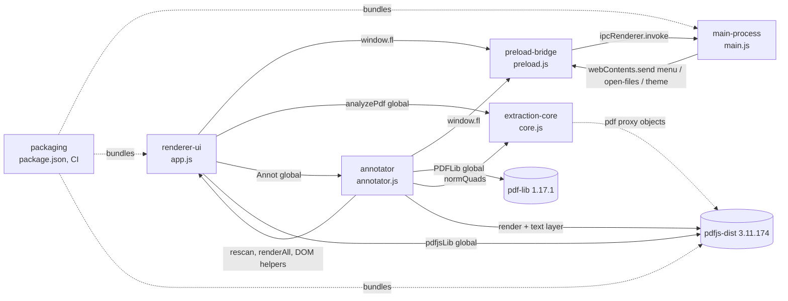

# Faelights — Codebase Atlas
> Last synced: 2026-10-09 · Synced at commit: c6424a0

## How to read this
Layer 0 (this file) → module docs in [modules/](modules/) → file entries inside each module doc.
History, rationale and roadmap live in [../PROJECT_COMPASS.md](../PROJECT_COMPASS.md), not here.

Faelights is an Electron 31 desktop app with no bundler, no framework and no tests. The renderer is plain browser scripts loaded by `<script>` tags in order; the main process is a single CommonJS file.

## Entry points
| Entry | File | What starts here |
|---|---|---|
| Electron main | `src/main.js` (`package.json` → `"main"`) | Single-instance lock, theme, app menu, splash + main `BrowserWindow`, all `ipcMain` channels |
| Splash | `renderer/splash.html` | Frameless window from `createSplash()`; destroyed by `revealMain()` |
| Preload | `src/preload.js` | Exposes `window.fl` bridge via `contextBridge` |
| Renderer page | `renderer/index.html` | Loads `pdf.min.js` → `pdf-lib.min.js` → `core.js` → `annotator.js` → `app.js` |
| Renderer boot | `renderer/app.js` `boot()` IIFE | Loads DB + theme, renders UI, sends `app:ready`, consumes pending "Open with" files |
| CLI / OS file open | `src/main.js` `pdfArgs()`, `second-instance`, `open-file` | PDFs passed on argv or macOS "Open with" |
| CI build | `.github/workflows/build.yml` | On `v*` tag: `electron-builder` for win/mac/linux |

## Module map

One deliberate two-way edge: renderer-ui ↔ annotator (app.js opens/mounts the viewer; annotator calls app.js helpers and `rescan` at call time). `core.js` has no imports; it only operates on the pdf.js document object passed to it.

| Module | Path | Responsibility | Depends on | Used by | Doc |
|---|---|---|---|---|---|
| main-process | `src/main.js` | Library JSON + PDF copies on disk, splash/main windows, theme, dialogs, menus, shell, clipboard | electron, node fs/path/crypto | preload-bridge (IPC) | [main-process.md](modules/main-process.md) |
| preload-bridge | `src/preload.js` | Maps `window.fl.*` → IPC channels | electron `contextBridge`, `ipcRenderer`, `webUtils` | renderer-ui | [preload-bridge.md](modules/preload-bridge.md) |
| extraction-core | `renderer/core.js` | Turns a pdf.js document into entries (sentences + highlight spans), topics, loose marks | pdf.js document API (passed in) | renderer-ui | [extraction-core.md](modules/extraction-core.md) |
| annotator | `renderer/annotator.js` | In-app PDF viewer; writes Highlight/Underline/StrikeOut/Text/Ink annotations with pdf-lib into the library copy; undo/redo | pdf-lib, pdfjs-dist, preload-bridge, extraction-core, renderer-ui helpers | renderer-ui | [annotator.md](modules/annotator.md) |
| renderer-ui | `renderer/app.js`, `index.html`, `splash.html`, `styles.css`, `assets/brand/*`, `sample.pdf` | State, three-pane UI, splash page, brand artwork, theme button, search, export formatting, drag/drop, keyboard | preload-bridge, extraction-core, pdfjs-dist, @fontsource | — (top of stack) | [renderer-ui.md](modules/renderer-ui.md) |
| packaging | `package.json`, `.github/workflows/build.yml` | Dependencies, scripts, electron-builder config, CI release builds | electron-builder | — | [packaging.md](modules/packaging.md) |

## Key flows (code-level traces)

### Add a PDF (button, drag/drop, menu, or "Open with")
`chooseAndAdd()` / window `drop` / `fl.onOpenFiles` / `boot()` pending → `app.js addPaths(paths)` →
existing `sourcePath` match? → `rescan()` (see below) ; else
`fl.importPdf(p)` → IPC `pdf:import` → `main.js` reads file, SHA-1 hash, writes `userData/library/files/<id>.pdf` → returns `{id, hash, storedPath, mtime…}` →
`fl.readPdf({...d, sourcePath:null})` → IPC `pdf:read` (reads stored copy) →
`app.js analyzeBytes()` → `pdfjsLib.getDocument` → `readMeta(pdf)` (`getMetadata` XMP + Info, page-1 text for DOI/arXiv) → `core.js analyzePdf(pdf)` → `{entries, loose, topics, topicSource, pages, count}` →
`summary()` adds `count`, `colours` → pushed to `S.db.docs` → `save()` (250 ms debounce) → `fl.saveDb` → IPC `db:save` → `main.js saveDb()` atomic tmp+rename write of `faelights.json`.

### Startup + staleness detection
`main.js whenReady` → `loadTheme()` reads `userData/theme.json` → `nativeTheme.themeSource` → `createSplash()` (shown on `ready-to-show`) + `createWindow()` (hidden) →
`app.js boot()` → `fl.loadDb()` + `fl.getTheme()` → IPC `db:load` → `main.js loadDb()` (repairs missing Inbox/settings; backs up unparseable file as `.broken-<ts>`) → for every doc `statOrNull(sourcePath)` sets `sourceMissing` and `stale` (mtime > `scannedMtime` + 1 s) → renderer `renderAll()` → `fl.ready()` → IPC `app:ready` → `main.js revealMain()` (keeps the splash up ≥ `SPLASH_MIN_MS` 2.3 s, then shows main and destroys splash; `SPLASH_MAX_MS` 8 s timer forces it) → `fl.pendingFiles()` → IPC `app:pending` drains `pendingOpen` → `addPaths()`.

### Rescan a changed PDF
`openDoc(id)` (if `d.stale && d.sourcePath`, or `outdated(d)`: result `v` < `ANALYZER_VERSION`) / doc menu "Rescan" / `rescanAll()` (stale or outdated docs, else all) → `app.js rescan(d)` → `fl.readPdf(d)` → IPC `pdf:read`: if original exists read it, and if newer than `scannedMtime` overwrite stored copy; else read stored copy → `analyzeBytes()` → `analyzePdf()` → doc fields replaced, `stale=false` → `save()`.

### Extraction pipeline (inside `core.js analyzePdf`)
per page: `getTextContent()` + `getAnnotations()` → keep Highlight/Underline/Squiggly/StrikeOut (`MARK_TYPES`) → `normQuads()` + `colorOf()` → build one char stream with line/paragraph breaks and de-hyphenation → per-char quad hit-test assigns annotation id → topics, first that succeeds: `resolveOutline()` (bookmarks, `topicSource:"outline"`) → font-size headings (`"headings"`) → if < 2, `patternTopics()` by wording (`"patterns"`) → `pageTopics()` one per page (`"pages"`) → snap highlight edges to whole words → `sentenceBounds()` (abbreviation-aware) → group & merge overlapping sentences → entries `{n, page, at, segs, spans, topic, sentence}`; annotations with no text hit go to `loose`. Result is stamped `v: ANALYZER_VERSION`. Entries before the first topic have `topic: null` and render under `PRE_TOPIC` ("Abstract") in `app.js`.

### Export
Reader "Export" / menu `export-doc` → `exportDoc(d)` → `docText(d, fmt, frontmatter)` (uses `groupsOf`, `entryLines`, `settings.mode`) → `fl.exportFile` → IPC `export:file` save dialog → write.
Library menu / menu `export-library` → `exportLibrary(id)` → per-doc `docText(..., frontmatter=true)` with de-duplicated `safeName`s → `fl.exportFolder` → IPC `export:folder` directory picker → writes `<dir>/<library name>/*.md|.txt` → `fl.openFolder`.

### Column resize / collapse
Pointer down on a `.resizer[data-pane]` (window-level listener in `app.js`) → `pointermove` sets `layout()[pane].w` (clamped to `PANES` min/max) or `closed` when dragged below ~half the minimum → `applyLayout()` writes `--side-w/--list-w/--rail-w` and `*-closed` classes on `#app` (borrowing width from list then sidebar so the reader keeps `READER_MIN`) → `pointerup` → `save()`. Hide buttons (`paneBtn`), strips (`strip`), focused-handle keys (`resizerKey`), double-click (reset one pane) and menu `pane:*` / `layout-reset` all end in `togglePane()` / `resetLayout()` → `applyLayout()` + `save()`. No pane re-renders.

### Info card (PDF metadata)
Reader `.info-btn` (left of the Full sentence / Highlights only switch) → toggles `settings.info` → `save()` + `renderReader()` → `infoEl(d)` prepended to `.r-main` → renders `d.meta` via `infoRows()`; if `d.meta` is missing → `loadMeta(d)` → `fl.readPdf({...d, sourcePath:null})` → `readMeta()` → `d.meta` → `save()` → `renderReader()`. `rescan()` also refreshes `d.meta`.

### Annotate a PDF
Reader toolbar "View" button (left of Info) / doc menu "Annotate" / clicking an extract's `p. N` → `app.js annotate(d, page)` → `Annot.open(d, page)` → `fl.readPdf(d)` (stored copy if `d.annotated`) → pdf.js doc + `PDFDocument.load` (pdf-lib, in the background) → `renderReader()` → `Annot.mount(#reader)` → pages drawn lazily (`drawPage`: canvas with `AnnotationMode.ENABLE` + `renderTextLayer`).
Edit (text selection + tool/popover, note click, ink drag, recolour, note, delete) → `edit(pages, fn)` on a serial queue → pdf-lib mutation (`addAnnot` / `recolorAnnot` / `setNote` / `deleteAnnot`, each writing an `/AP` stream) → `lib.save()` → push `{bytes, pages}` on `undo` → `swap()`: new pdf.js doc, bump `pageVer` for those pages, redraw them → `persist()`: `d.annotated = true`, `fl.writeStored(d.storedPath, bytes)` → IPC `pdf:writeStored` (atomic write inside `FILES_DIR`) + `save()`.
Undo/redo → `history()` swaps byte snapshots (pdf-lib doc reloaded lazily). "Download PDF" → `fl.savePdfAs` → IPC `pdf:saveAs`.
Leave (back button / Esc / another doc / search) → `Annot.close()` → after `queue` + `writing` settle → `rescan(d)` → `pdf:read` returns the stored copy → `analyzePdf` → new marks appear as extracts. Doc menu "Discard annotations made here…" → `useOriginal(d)`: `annotated=false`, `scannedMtime=0`, `rescan` → `pdf:read` re-copies the original over the stored copy.

### Theme change
Sidebar footer `themeSwitch()` (monitor / sun / moon icons, one click each) → `fl.setTheme(t)` → IPC `theme:set` → `main.js applyTheme(t)` sets `nativeTheme.themeSource`, `setBackgroundColor` on every window, writes `userData/theme.json`, rebuilds the menu, pushes `theme` → `fl.onTheme` → `S.theme`, `renderSide()`. View → Theme radio items call `applyTheme` directly. All styling and `<picture>` brand art react through `prefers-color-scheme`.

## Cross-cutting couplings
| Kind | Key | Producers | Consumers |
|---|---|---|---|
| IPC invoke | `db:load`, `db:save`, `app:pending` | `preload.js` | `main.js` |
| IPC invoke | `pdf:choose`, `pdf:import`, `pdf:read`, `pdf:stat`, `pdf:open`, `pdf:reveal`, `pdf:relink`, `pdf:removeStored`, `pdf:writeStored`, `pdf:saveAs` | `preload.js` | `main.js` |
| IPC invoke | `export:file`, `export:folder`, `export:openFolder`, `clip:write`, `menu:popup`, `ask:confirm` | `preload.js` | `main.js` |
| IPC invoke | `theme:get`, `theme:set` | `preload.js` | `main.js` |
| IPC send (renderer → main) | `app:ready` | `app.js boot()` via `fl.ready()` | `main.js revealMain()` |
| IPC push | `menu` (payloads: `add`, `new-library`, `export-doc`, `export-library`, `rescan-all`, `search`, `toggle-mode`, `pane:side`, `pane:list`, `pane:rail`, `layout-reset`) | `main.js buildAppMenu()` | `app.js fl.onMenu` handler |
| IPC push | `open-files` | `main.js` `second-instance` / `open-file` | `app.js fl.onOpenFiles` → `addPaths` |
| IPC push | `theme` (`system`/`light`/`dark`) | `main.js applyTheme()` | `app.js fl.onTheme` |
| Persisted file | `userData/theme.json` (`{theme}`) | `main.js applyTheme` | `main.js loadTheme` at startup |
| Persisted file | `userData/library/faelights.json` (`{version, libraries, docs, settings}`) | `main.js saveDb` (whole object from renderer) | `main.js loadDb` → renderer `S.db` |
| Persisted dir | `userData/library/files/<docId>.pdf` | IPC `pdf:import`, `pdf:read` (refresh), `pdf:writeStored` (annotator) | `pdf:read`, `pdf:open`, `pdf:reveal`; deleted by `pdf:removeStored` |
| Doc flag | `annotated` (+ `annotatedAt`) | `annotator.js persist()`; cleared by `app.js useOriginal()` | `main.js` `pdf:read` (stored copy only) and `db:load` (never stale); `app.js` list pill + doc menu |
| Global (window) | `PDFLib` | `pdf-lib.min.js` script tag | `annotator.js` |
| Global (window) | `Annot` | `annotator.js` | `app.js renderReader`, `annotate`, `openDoc`, `removeDoc`, `useOriginal`, keydown |
| Global (window) | `normQuads` | `core.js` | `annotator.js pickAt` (also core itself) |
| Global (window) | `pdfjsLib` | `pdf.min.js` script tag | `app.js` (`GlobalWorkerOptions`, `getDocument`) |
| Global (window) | `analyzePdf`, `ANALYZER_VERSION` | `core.js` (top-level) | `app.js analyzeBytes`, `outdated()` |
| Result version | `result.v` | `core.js analyzePdf` | `app.js outdated()` → rescan on open / Rescan all |
| Global (window) | `fl` | `preload.js` | `app.js` everywhere |
| Magic id | library id `"inbox"` (`system: true`) | `main.js EMPTY_DB/loadDb` | `app.js` (default target, delete fallback, boot) |
| Drag MIME | `application/x-faelights-doc` | `app.js renderDocs` dragstart | `app.js navItem` drop on library |
| Relative paths | `../node_modules/pdfjs-dist/build/*.min.js`, `../node_modules/pdf-lib/dist/pdf-lib.min.js`, `../node_modules/@fontsource/*` | `package.json build.files` | `index.html`, `app.js` worker src, `styles.css @import` |
| Brand asset paths | `assets/brand/{mark,mote,splash}-{light,dark}.svg`, `favicon-*.ico`, `app-icon.png` | files in `renderer/assets/brand/` | `app.js brandImg()`, `index.html`, `splash.html`, `main.js ICON` |
| Media query | `prefers-color-scheme` | `nativeTheme.themeSource` (main) | `styles.css`, `splash.html`, `<picture>` sources |
| Settings keys | `settings.mode` (`full`/`only`), `fmt` (`md`/`obsidian`/`plain`), `sort` (`added`/`title`/`count`) | `main.js EMPTY_DB` defaults | `app.js` reader, export, list |
| Settings key | `settings.info` (boolean; no main default) | `app.js` info toggle | `app.js renderReader()` |
| Settings key | `settings.annotColor` (`[r,g,b]` 0–1; no main default, falls back to yellow) | `annotator.js` swatches / popover | `annotator.js color()` |
| Settings key | `settings.layout` (`{side,list,rail: {w, closed}}`; no main default, filled by `app.js layout()`) | `app.js` drag / toggle / `resetLayout` | `app.js applyLayout()` |
| CSS vars + classes on `#app` | `--side-w`, `--list-w`, `--rail-w`; `side-closed`, `list-closed`, `rail-closed`, `wide` | `app.js applyLayout()`, `renderList()` | `styles.css` grid, strips, `.app > .resizer` positions |
| Env vars | none read | — | — |

## Conventions
- All filesystem, dialog, shell and clipboard access stays in `main.js` behind an `ipcMain.handle`. The renderer runs with `contextIsolation: true`, `nodeIntegration: false` and `sandbox: true`, and only reaches the OS through `window.fl`.
- Adding an OS capability takes three edits: `ipcMain.handle("<area>:<verb>")` in `main.js`, a `fl.<name>` wrapper in `preload.js`, and the call site in `app.js`.
- `core.js` is pure analysis with no DOM and no `fl`. Keep it that way so it stays usable from Node (it has a `module.exports` guard).
- The renderer is immediate-mode: mutate `S` / `S.db`, call `save()`, then `renderAll()` (or `renderSide`/`renderList`/`renderReader`). There is no diffing.
- IDs: docs `"d" + base36 time + random`, libraries `"l" + base36 time`.
- CSS uses custom properties on `:root`, with a dark override under `prefers-color-scheme: dark`. Never add a theme class: the light/dark choice is made only through `nativeTheme.themeSource` in `main.js`.
- Light/dark artwork goes in `renderer/assets/brand/` as `<name>-light.svg` / `<name>-dark.svg` and is placed with `brandImg(name)` (or a `<picture>` in static HTML).
- Bump `ANALYZER_VERSION` in `core.js` whenever extraction output changes, so saved docs rescan.
- PDF bytes are only ever written to the stored copy (`pdf:writeStored`) or a user-chosen path (`pdf:saveAs`), never to `sourcePath`.

## File → module index
| File | Module |
|---|---|
| `.github/workflows/build.yml` | packaging |
| `build/icon.png` | packaging |
| `package.json` | packaging |
| `renderer/annotator.js` | annotator |
| `renderer/app.js` | renderer-ui |
| `renderer/assets/brand/*` | renderer-ui |
| `renderer/core.js` | extraction-core |
| `renderer/index.html` | renderer-ui |
| `renderer/sample.pdf` | renderer-ui |
| `renderer/splash.html` | renderer-ui |
| `renderer/styles.css` | renderer-ui |
| `src/main.js` | main-process |
| `src/preload.js` | preload-bridge |

## Excluded
`node_modules/`, `dist/` (gitignored build output), `package-lock.json`, `README.md`, `.gitignore`.
