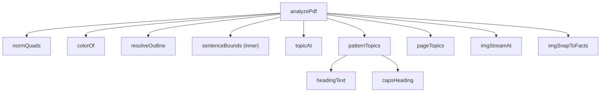

# Module: extraction-core
> Path: renderer/core.js · Last synced commit: 40bb2c7 · Related features: F-001, F-002, F-007, F-015

## Purpose
This module is the PDF highlight extraction algorithm. Given a loaded pdf.js document, it rebuilds the text stream in reading order, works out which characters each markup annotation covers, expands the marks to whole sentences, and assigns each one to a topic taken from bookmarks or detected headings. It has no DOM, IPC or persistence code.

## Public interface
- `analyzePdf(pdf, onProgress?)` → `{ v, entries, loose, topics, topicSource, pages, count, images }`
  - `entries[]`: `{ n, page, at, segs:[{t, hl}], spans:[{id, color, type, comment, text}], topic, sentence }`
  - `loose[]`: `{ page, color, type, comment }` for marks with no text under them (scans or images)
  - `topics[]`: `{ title, path[], level, page, at }`; `topicSource` is `"outline"`, `"headings"`, `"patterns"` or `"pages"`
  - `images[]`: `{ id, n, page, rect:[x1,y1,x2,y2], color, comment, at, topic }` from every `Square` annotation (image boxes), sorted by `at` then top-to-bottom, left-to-right. Not counted in `count`, never in `loose`
  - `v`: `ANALYZER_VERSION` (currently 3)
  - `onProgress(page, numPages)` is called once per page
- `ANALYZER_VERSION`: bumped whenever output changes; the renderer rescans docs with an older `result.v`.
- `imgStreamAt(im, lines, textLen)` (an image's reading-order position: first line below the box top that overlaps it horizontally → first line below → end of page → next page with text) and `imgSnapToFacts(imgs, groups)` (an image inside a merged fact's `[start, end]` moves to the fact's start).
- All are browser globals (top-level declarations). There is also `module.exports = { analyzePdf, ANALYZER_VERSION, imgStreamAt, imgSnapToFacts }` when `module` exists.

## Dependencies
- **Uses:** pdf.js document/page API through the `pdf` argument (`numPages`, `getPage`, `getTextContent`, `getAnnotations`, `getOutline`, `getDestination`, `getPageIndex`)
- **Used by:** renderer-ui (`app.js analyzeBytes`); annotator (`normQuads` for hit-testing existing annotations)
- **External libs:** none imported directly. It assumes the pdf.js 3.11.174 annotation shape (`quadPoints`, `contentsObj`, `titleObj`, `color`).

## Internal structure

## Data & state owned
None. It is a pure function of the input document, and the result is stored by the caller in `doc.result`.

## Files

### `renderer/core.js`
- **Role:** extraction engine
- **Exports:** `analyzePdf` (global, and CommonJS when available)
- **Internal:** `MARK_TYPES` (Highlight, Underline, Squiggly, StrikeOut→"Strike"), `ABBR` regex, `normQuads(a)`, `colorOf(a)` (default `[255,214,64]`), `resolveOutline(pdf)`, `topicAt(topics, at)`, `patternTopics(lines, text)`, `headingText(t)`, `capsHeading(t)`, `pageTopics(lines)`; regexes `SECTION_NAMES`, `NUMBERED`, `RUN_IN`, `CAPTION`
- **Imports (internal):** none
- **Used by:** `renderer/app.js`, `renderer/annotator.js` (`normQuads`); `result.images` is read by `order.js`, `images.js`, `exportfmt.js`
- **Side effects:** none
- **Change impact:** the shape of `entries` / `spans` / `segs` / `topics` is persisted in `faelights.json` and read by `app.js` rendering (`quoteEl`, `groupsOf`), export (`docText`, `entryLines`), search (`renderResults`) and colour filters (`ckey`). Shape or quality changes must bump `ANALYZER_VERSION`; `app.js` then rescans outdated docs on open and in Rescan all.

## Gotchas
- Glyph x positions are approximated as `width / n` per character, which is why the word-snapping pass that follows exists.
- A paragraph break is detected from page change, vertical gap > 1.75× font size, font-size jump > 12%, or an x outdent. It is stored as `"\n\n"` and is the sentence boundary.
- De-hyphenation only joins `letter-\nlowercase`.
- Heading detection uses lines ≥ 1.12× the most common (body) font size, at most 110 chars, and keeps up to 4 size levels. Consecutive same-size lines are merged as wrapped headings.
- Sentences are capped at about 320 chars on each side of the highlight.
- Overlapping sentence groups merge, so one entry can hold several spans.
- Outline destinations that fail to resolve are skipped silently.
- Wording-based detection (`patternTopics`) runs only when font-size detection finds fewer than 2 headings. It accepts numbered lines (`1`, `2.1`, `IV.`, `A.`) with a short capitalised title and no closing punctuation, common section names, short ALL-CAPS lines, and run-in `Abstract—`/`Keywords:`. It drops captions (`Fig`, `Table`…) and any title found on 3+ pages (running headers). Short numbered list items can be misread as headings.
- Numbered heading level comes from dot depth (`2.1` → 2), capped at 3; `A.` → 2, roman → 1.
- Line ~117 has a no-op ternary `last.hl === -2 ? -1 : -1`.
- Line records now also carry their x-extent (`xa`/`xb`), used only by `imgStreamAt`.
- Consumers place an image before entry `e` when `img.at <= e.at`; `imgSnapToFacts` guarantees an image that falls inside a fact gets that fact's `at`, so it lands before it.
- Any Square annotation counts as an image box, including ones made by other apps (Zotero exports its image annotations as Squares).
