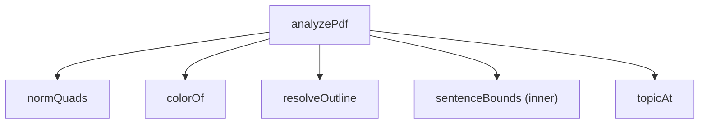

# Module: extraction-core
> Path: renderer/core.js · Last synced commit: 18c8052 · Related features: —

## Purpose
This module is the PDF highlight extraction algorithm. Given a loaded pdf.js document, it rebuilds the text stream in reading order, works out which characters each markup annotation covers, expands the marks to whole sentences, and assigns each one to a topic taken from bookmarks or detected headings. It has no DOM, IPC or persistence code.

## Public interface
- `analyzePdf(pdf, onProgress?)` → `{ entries, loose, topics, topicSource, pages, count }`
  - `entries[]`: `{ n, page, at, segs:[{t, hl}], spans:[{id, color, type, comment, text}], topic, sentence }`
  - `loose[]`: `{ page, color, type, comment }` for marks with no text under them (scans or images)
  - `topics[]`: `{ title, path[], level, page, at }`; `topicSource` is `"outline"` or `"headings"`
  - `onProgress(page, numPages)` is called once per page
- Exposed as a browser global (top-level `function`). There is also `module.exports = { analyzePdf }` when `module` exists.

## Dependencies
- **Uses:** pdf.js document/page API through the `pdf` argument (`numPages`, `getPage`, `getTextContent`, `getAnnotations`, `getOutline`, `getDestination`, `getPageIndex`)
- **Used by:** renderer-ui (`app.js analyzeBytes`)
- **External libs:** none imported directly. It assumes the pdf.js 3.11.174 annotation shape (`quadPoints`, `contentsObj`, `titleObj`, `color`).

## Internal structure

## Data & state owned
None. It is a pure function of the input document, and the result is stored by the caller in `doc.result`.

## Files

### `renderer/core.js`
- **Role:** extraction engine
- **Exports:** `analyzePdf` (global, and CommonJS when available)
- **Internal:** `MARK_TYPES` (Highlight, Underline, Squiggly, StrikeOut→"Strike"), `ABBR` regex, `normQuads(a)`, `colorOf(a)` (default `[255,214,64]`), `resolveOutline(pdf)`, `topicAt(topics, at)`
- **Imports (internal):** none
- **Used by:** `renderer/app.js`
- **Side effects:** none
- **Change impact:** the shape of `entries` / `spans` / `segs` / `topics` is persisted in `faelights.json` and read by `app.js` rendering (`quoteEl`, `groupsOf`), export (`docText`, `entryLines`), search (`renderResults`) and colour filters (`ckey`). Shape changes need a rescan of existing docs (`rescanAll` only rescans docs that are stale or have no result, unless none are, in which case it rescans all).

## Gotchas
- Glyph x positions are approximated as `width / n` per character, which is why the word-snapping pass that follows exists.
- A paragraph break is detected from page change, vertical gap > 1.75× font size, font-size jump > 12%, or an x outdent. It is stored as `"\n\n"` and is the sentence boundary.
- De-hyphenation only joins `letter-\nlowercase`.
- Heading detection uses lines ≥ 1.12× the most common (body) font size, at most 110 chars, and keeps up to 4 size levels. Consecutive same-size lines are merged as wrapped headings.
- Sentences are capped at about 320 chars on each side of the highlight.
- Overlapping sentence groups merge, so one entry can hold several spans.
- Outline destinations that fail to resolve are skipped silently.
- Line ~117 has a no-op ternary `last.hl === -2 ? -1 : -1`.
