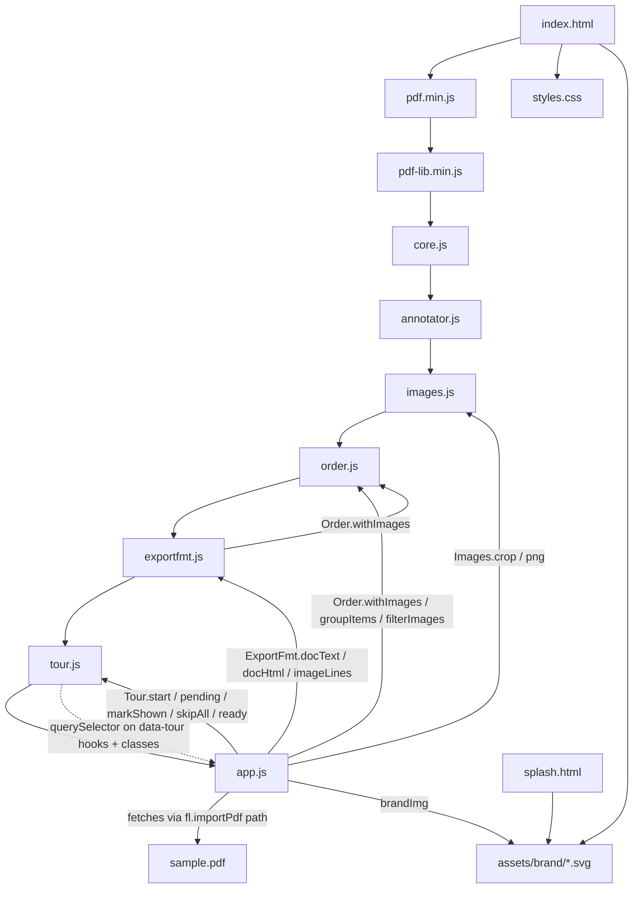

# Module: renderer-ui
> Path: renderer/ (app.js, images.js, order.js, exportfmt.js, tour.js, index.html, splash.html, styles.css, assets/brand/, sample.pdf) · Last synced commit: 43721ca · Related features: F-001…F-011, F-013, F-014, F-015, F-016, F-022

## Purpose
This is the whole user interface plus the splash page and brand artwork. It holds app state (`S`), renders the three panes (library sidebar, PDF list, extract reader) and the search view, and formats exports. It drives PDF import, rescan and analysis by combining `window.fl` (OS access) with `analyzePdf` (extraction). It does not touch the filesystem directly.

## Public interface
None. This is the top of the stack. It reacts to DOM events, `fl.onMenu` (including `pane:side|list|rail`, `layout-reset`, `add-id` and `tour`), `fl.onOpenFiles` and `fl.onFetchProgress`.

## Dependencies
- **Uses:** preload-bridge (`fl.*`), extraction-core (`analyzePdf`, `result.images`), annotator (`Annot.open/close/mount/key/isOpen/docId`), pdfjs-dist (`pdfjsLib` global, worker at `../node_modules/pdfjs-dist/build/pdf.worker.min.js`), @fontsource (Figtree, Newsreader, Young Serif through CSS `@import`)
- **Used by:** `main.js` loads `splash.html` and `assets/brand/app-icon.ico` (Windows) / `app-icon.png`; annotator calls back into `rescan`, `renderAll`, `renderReader`, `save`, `S` and the DOM helpers (`el`, `svg`, `btn`, `toast`, `copyText`, `plural`, `safeName`)

## Internal structure

`app.js` sections:
- **state:** `S`, `save()`, lookups `doc()` / `lib()`, `PRE_TOPIC`, `outdated(d)`, `THEMES`, `brandImg(name, cls)`
- **analysis:** `cleanTitle`, `DOI_RE`, `ARXIV_RE`, `pdfDate`, `readMeta(pdf)` (XMP dc/prism → Info dict → DOI/arXiv regex on page 1), `analyzeBytes` (returns `{title, meta, result}`), `loadMeta(d)` (lazy metadata for older docs), online details `LOOKUP_SOURCE`, `metaOf(d)` (`d.meta` overlaid with `d.lookup.meta`), `lookupQuery(d)` (`{doi, arxiv, origin}` or `null`), `lookUp(d, quiet)` (offline → fails at once; `lookUp.busy` guard; `fl.lookupMeta` → `d.lookup`; sets `d.title` only when the PDF had no title and `!d.titleEdited`), `summary`, `addImported(info, target, opts)` (analyses an already-imported PDF and pushes the doc; `opts.origin`, `opts.title` fallback, `opts.sample`), `addPaths` (disk files → `fl.importPdf` → `addImported`), `rescan`, `rescanAll`
- **libraries:** `newLibrary`, `deleteLibrary`, `libraryMenu(id, at?, opts?)`
- **action menu:** `openMenu(at, items, opts)` → Promise of the chosen id or `null` (themed `.amenu` popover; `at` = element (opens below) or `{x,y}`; items `{id,label,icon,hint,danger,disabled,checked,submenu}`, separators and headings; keyboard, type-ahead, submenus, ARIA `menu`/`menuitem(checkbox)`), `closeMenu()`, `MENU` (open menu or `null`), `kbdNav`, `keyHint(k, shift)`, `moreBtn(label)` (⋯ trigger), `menuKey(e, open)` (Shift+F10 / ContextMenu)
- **doc actions:** `removeDoc`, `setMine(d, on)`, `docMenu(d, at?, opts?)` (themed menu with icons; adds Mark as my publication / Remove from My publications, Annotate, Save PDF copy / Save annotated PDF, Discard annotations made here), `moveDoc`, `annotate(d, page?)`, `savePdfCopy(d)`, `useOriginal(d)`, `relink`
- **export:** aliases `wrapHl` / `entryLines` / `groupsOf` → `ExportFmt.*`, `exportOpts(d)`, `docText(d, fmt, frontmatter, entries?, images?)`, `docHtml(d, images)`, `safeName`, `exportFileBase`, `exportImageList(d)`, `exportWithImages(d)` (`settings.images` and the doc has images), `exportImages(d, fmt, dir, tick)` (renders crops via `Images.png`/`crop`; html → data URLs, else assets; a failed crop → placeholder ref), `exportProgress(total)` (toast "Preparing images… k/n"), `exportDoc(d, fmt?)` (no images and not html → `fl.exportFile`; else `fl.exportBundle`), `exportMenu(d, at)` (Export as Markdown/Obsidian/HTML/Plain text + "Include images" check item), `exportLibrary(id)` (`fl.exportFolder` with `assets`)
- **layout:** `PANES` (min/max/default widths), `STRIP`, `READER_MIN`, `layout()` (normalises `settings.layout` in place), `applyLayout()`, `togglePane(k, open?)`, `resetLayout()`, `paneBtn(k)`, `strip(k, label?)`, `resizer(k)`, `syncResizer(h)`, `resizerKey(e, h)`, window `pointerdown`/`dblclick`/`resize` listeners
- **render:** `renderSide`/`themeSwitch`/`navItem`/`go`, `renderList` (header `.head-acts`: Add PDFs, add-by-link, hide pane)/`renderDocs`/`visibleDocs`/`renderProgress`, `openDoc`, `renderReader`/`infoEl`/`infoRows`/`fmtDate`/`quoteEl`/`markEl`/`appendHits`/`TOPIC_SOURCE`/`filtered`/`filteredImages`/`withImages`/`spanCount`/`figureEl(d, img)` (Copy button + right-click menu: Copy image / Show page)/`copyImage(d, img)` (`Images.png` → `fl.copyImage`)/`IMG_ICON`/`renderBlank`, `renderSearch`/`renderResults`, `renderAll`
- **add by identifier:** `addIdBtn(compact)`, `openAddId(prefill?)` (dialog with an auto-growing `<textarea>`; Enter submits, Shift+Enter adds a line; prefills from the clipboard when `looksLikeIds`), `closeAddId`, `addIdHint` (`fl.parseIds` → one label, or "N recognised · M not recognised"; Offline pill), `addIdBusy`, `addIdFail(reason, landingUrl)`, `addIdActs`, `ADD_OPEN` / `ADD_FAIL` (incl. `no-free-copy`), `submitAddId` (one item → the single flow; several → `addIdBatch(D)`: one `fl.fetchPdf` at a time, a status row per item via `addIdRow`, `stopAddBatch` / `addIdCancelLabel` for Cancel), `looksLikeIds(items)` (at least half recognised), `fl.onFetchProgress` handler
- **guided tour:** `startTour(name)` (passes `Tour.pending` steps; `onShow` → `Tour.markShown` + `save()`; Skip → `Tour.skipAll`; finishing the app chapter → `tourSoon()`), `maybeTour()` (no tour while the add dialog, an action menu or title editing is open; picks app → viewer (if `Annot.isOpen()`) → reader by `Tour.ready(Tour.pending(…))`), `tourSoon()` (500 ms debounce; called at the end of `renderReader` and from `annotate`). `data-tour` hooks: `add`, `add-id`, `search`, `all`, `starred`, `mine` (via `navItem({tour})`), `libraries` (h3 + ul), `foot`, `pane` (sidebar `paneBtn`), `list-tools`, `start` (`.list-empty` of an empty library and the `renderBlank` button row), `view`, `copy`, `export`
- **input:** `chooseAndAdd`, `addSample`, window drag/drop (a dropped `text/uri-list` opens the add-by-identifier dialog with all its lines), `paste` (parseable text outside inputs opens it), keydown, `fl.onMenu` (`tour` → clears `settings.tour`, `startTour("app")`), `fl.onOpenFiles`, `fl.onTheme`, `boot()` (ends with `fl.ready()`, then `maybeTour` after 900 ms); the `paste` handler ignores pastes while the tour is open

## Data & state owned
- `S` (in memory): `db` (the mirror of `faelights.json`), `view` (`{kind: library|all|starred|mine|tag|search, id?, tag?}`), `docId`, `docQuery`, `searchQuery`, `searchLib`, `off` (hidden colour keys), `busy` (progress), `renaming`, `editingTitle`, `jumpTo`, `theme` (a mirror of the main-process theme)
- Doc record fields it writes: `origin` (`{kind: doi|arxiv|pmcid|pmid|isbn|ads|url, value, url}`, only on docs added by identifier, which have `sourcePath: null`), `id, libraryId, title, fileName, sourcePath, storedPath, hash, addedAt, tags[], starred, scannedMtime, scannedAt, meta, result, pages, count, colours[]`, `annotated` (cleared by `useOriginal`; set by annotator), and `mine` (boolean, "My publications"; set by `setMine`), `lookup` (`{source: crossref|arxiv, id, at, meta}`, written by `lookUp`; `rescan` leaves it alone) and `titleEdited` (set when the user renames a doc)
- `meta` (optional; missing on docs scanned before F-006): `{title, authors[], abstract, publication, volume, issue, pages, date, doi, arxiv, issn, isbn, publisher, url, rights, keywords[], creator, producer, created, modified, pdfVersion}`. Empty fields are omitted; a failed lazy read leaves `{}` in memory only
- Library record: `{id, name, createdAt, system?}`
- `S.db.settings.tour` = `{app|reader|viewer: [step ids shown] | true}` (`true` after Skip tour; `{}` after Help › Show Tour; missing on a fresh install) — written through `Tour.markShown` / `Tour.skipAll`
- `S.db.settings.mode | fmt | sort | layout | info | annotColor | images` (`fmt` adds `html`; `images` = boolean "With images", read by the reader and export; `info` = boolean, Info card shown; `layout` = `{side,list,rail: {w, closed}}`; `annotColor` written by annotator)

## Files

### `renderer/app.js`
- **Role:** UI controller and view layer
- **Exports:** none (browser script; all functions are globals in the page)
- **Imports (internal):** globals `fl` (preload), `analyzePdf` + `ANALYZER_VERSION` (core.js), `Images` (images.js), `Order` (order.js), `ExportFmt` (exportfmt.js), `Tour` (tour.js), `pdfjsLib`
- **Used by:** `index.html`
- **Side effects:** every persistence and OS call goes through `fl.*`. It sets `pdfjsLib.GlobalWorkerOptions.workerSrc`, and registers window `dragenter/dragleave/dragover/drop/keydown/pointerdown/dblclick/resize` listeners. `boot()` appends the sidebar and list `.resizer` handles to `#app`; `renderReader` adds the rail one.
- **Change impact:** export output format (`ExportFmt.docText`, `entryLines`) is what users paste into Notion and Obsidian. `ckey()` colour bucketing (rounded to multiples of 24) drives both list swatches and reader colour filters. DB field renames need a migration in `main.js loadDb`.

### `renderer/images.js`
- **Role:** cuts an image box (`result.images[i]`) out of the stored PDF as a PNG. Global `Images`.
- **Exports:** `Images.crop(d, img, scale=2)` → `Promise<{url, width, height}>` (data URL), `Images.png(d, img, scale)` → `Promise<Uint8Array>`, `Images.forget(docId)`
- **Imports (internal):** `fl.readPdf` (stored copy: `sourcePath: null`), `pdfjsLib`
- **Used by:** `app.js figureEl` (reader), `app.js exportImages` (export); `removeDoc` / `rescan` call `forget`
- **Side effects:** keeps one pdf.js document per doc open (closed after 30 s idle); renders one crop at a time (serial queue); caches crops by `docId|hash:annotatedAt:scannedMtime|img.id|page|rect|scale`. Renders with `AnnotationMode.DISABLE`, so neither the box outline nor highlights end up in the picture; caps a crop at 2400 px.
- **Change impact:** the doc-version part of the cache key must change whenever the stored copy changes, or stale crops show.

### `renderer/order.js`
- **Role:** pure ordering of extracts and images (no DOM). Global `Order`; `module.exports` for tests.
- **Exports:** `ckey(color)` (copy of app.js `ckey`), `imagesOf(result)` (`[]` when missing), `filterImages(images, offSet)`, `withImages(entries, images)` → `[{kind:"entry", entry, topic} | {kind:"image", image, topic}]` (image before entry when `img.at <= e.at`), `groupItems(items)` → `[{key, topic, items, entries, images}]` (same keys as `groupsOf`)
- **Used by:** `app.js renderReader` (via `withImages` / `filteredImages`), `exportfmt.js exportItems`, `test/reader-images.test.js`
- **Change impact:** the placement rule here is the single source of truth for the reader and exports.

### `renderer/exportfmt.js`
- **Role:** pure export formatting (no DOM, no IPC). Global `ExportFmt`; `module.exports` for tests.
- **Exports:** `PRE_TOPIC`, `FORMATS`, `extOf(fmt)`, `wrapHl`, `entryLines`, `groupsOf` (groups any item by `.topic`), `exportItems(entries, images)` (entries + images tagged `kind:"image"`, via `Order.withImages`), `isImage`, `imageFile(img)` (`p<page>-<n>.png`), `mdLink(path)`, `imageLines(ref, fmt)` (md `- `, obsidian `- ![[…]]`, plain `- [Image p. N: …]`, the copy placeholder `[Image, p. N]`, the failed-crop line), `docText(d, fmt, frontmatter, entries, opts)`, `esc`, `docHtml(d, opts)` (self-contained HTML; images as `data:` URIs only)
- **Imports (internal):** `Order` (global, or `require("./order.js")` in Node)
- **Used by:** `app.js` export section, `test/export.test.js`
- **Change impact:** with no images, md/obsidian/plain output must stay byte-identical to the output before F-016 (tested).

### `renderer/tour.js`
- **Role:** first-run guided tour: step data per chapter plus the overlay that spotlights each step's target. Global `Tour`; `module.exports` for tests (the step data and helpers load in Node; the overlay needs a DOM).
- **Exports:** `CHAPTERS` (`app`, `reader`, `viewer`: `[{id, sel?, first?, title, body, keys?}]`; `id` = slugged title; no `sel` = centred card; `first` = spotlight only the first match), `NAMES`, `pending(settings, ch)`, `seen(settings, ch)`, `markShown(settings, ch, step)`, `skipAll(settings)`, `ready(steps, hasFn?)` (some step's target is on screen), `nextIndex(steps, from, dir, has)`, `progress(steps, i, has)`, `start(name, {steps, onShow, onEnd, extra})`, `end(skipped, quiet)`, `isOpen()`, `chapter()`
- **Imports (internal):** none. At runtime it reads the DOM by selector: `[data-tour=…]` hooks set in `app.js`/`annotator.js`, and classes/ids `#docs`, `.doc-row`, `.r-title`, `.r-meta`, `.info-btn`, `.r-tools .seg`, `.img-btn`, `#fmt`, `.rail .chips`, `.rail .toc`, `.r-main .ex`, `.copy1`, `.pv-seg`, `.pv-swatches`, `.pv-page-box`, `.pv-zoom`
- **Used by:** `app.js` guided-tour section, `test/tour.test.js`
- **Side effects:** while open, appends `.tour-shield` (eats clicks), `.tour-back` (dim layer, `clip-path` hole over the target), `.tour-ring` and `.tour-pop` (role `dialog`) to `<body>`; a capture-phase window `keydown` listener that stops every key reaching the page (←/→/Enter/Esc/Tab handled); re-places every 250 ms and on resize; moves on when the target disappears; adds `.tour-target` to spotlit elements (shows the hover-only `.copy1`). Restores focus on end.
- **Change impact:** renaming a class or `data-tour` hook it targets silently skips that step (guarded by `test/tour.test.js`). Rewording a step title changes its id, so that step shows again for users who saw it.

### `renderer/index.html`
- **Role:** page shell with three mount points `#side`, `#list`, `#reader`, plus `#drop` overlay (with the mote `<picture>`) and `#toast`. It links the light/dark favicons.
- **Side effects:** CSP `default-src 'self'; script-src 'self'; worker-src 'self' blob:` and others. No inline scripts are allowed.
- **Change impact:** script order matters: `pdf.min.js` → `pdf-lib.min.js` → `core.js` → `annotator.js` → `images.js` → `order.js` → `exportfmt.js` → `tour.js` → `app.js` (`exportfmt.js` needs `Order`). `annotator.js` must come before `app.js` because `boot()` can resume between scripts.

### `renderer/styles.css`
- **Role:** all styling. Design tokens on `:root` with a dark override, the three-column grid `.app` sized by `--side-w`/`--list-w` (`.wide` hides the list during search), column handles `.resizer`, collapsed `.strip`s and `*-closed` classes, `.pane-btn`, the reader split `.r-body` → `.rail-pane` + `.r-main` (each scrolls on its own; rail hidden by a `@container` query under 600 px), global `::-webkit-scrollbar` styling, and component classes used by `app.js` (`.amenu*` action menu, `.row-more` ⋯ triggers, `.doc-row` card wrapper, the add-by-identifier dialog block (`.addid*`, incl. the batch status rows), the guided tour block (`.tour-shield`, `.tour-back`, `.tour-ring`, `.tour-pop`, `.tour-step`, `.tour-acts`, `.copy1.tour-target`), `.nav`, `.doc`, `.r-head`, `.group`, `.ex`, `mark.u`/`mark.s`, `.chip`, `.info`/`.info-grid`/`.info-btn`, `.s-hit`, `.toast`, `.drop`…), and the annotator's `.pv*` classes plus a trimmed copy of pdf.js's `.textLayer` rules. `.pg` is now a `button` (page number opens the viewer)
- **Imports:** `@fontsource` CSS from `../node_modules/…`
- **Change impact:** class names are string-coupled to `el(tag, cls)` calls in `app.js`. Highlight colour reaches CSS as the `--mc` custom property (`"r g b"`).

### `renderer/splash.html`
- **Role:** static splash page: a `<picture>` of the animated lockup `splash-light|dark.svg` (dots appear, mote blooms, wordmark writes in by ~2.2 s, then fades out from 2.9 s) + "Gathering your highlights…". Its tokens are inline and follow `prefers-color-scheme`. It has no script.
- **Used by:** `main.js createSplash()`
- **Change impact:** the colours duplicate `styles.css` `--bg/--ink/--muted` and `main.js themeBg()`.

### `renderer/assets/brand/`
- **Role:** brand files: `mark-light|dark.svg` (ring of dots + mote with pulsing halo), `splash-light|dark.svg` (animated mark + outlined wordmark lockup, 1176×303), `mote-light|dark.svg` (dot), `favicon-light|dark.ico`, `app-icon.png` (256 px window icon, rendered from `mark-dark.svg` on a `#1F1C2A` tile filling ~96% of the canvas) and `app-icon.ico` (the same tile at 16/20/24/32/40/48/64/128/256 px, used for the window on Windows)
- **Used by:** `app.js brandImg()` (sidebar mark, empty-state mote), `index.html` (drop overlay, favicons), `splash.html`, `main.js ICON`
- **Change impact:** the SVGs carry their own CSS animation, which honours `prefers-reduced-motion`.

### `renderer/sample.pdf`
- **Role:** demo document added by "Try a sample PDF" (`addSample` → `addPaths([path], {sample:true})`). It is stored with `sourcePath: null`, so it never goes stale.

## Gotchas
- Saves are debounced by 250 ms and send the entire DB, including every `result`, over IPC on each change.
- `process_platform()` sniffs `navigator.userAgent` for "Mac", because `process` isn't available in the sandbox.
- `addPaths` matches existing docs by exact `sourcePath`. A PDF already in the library is rescanned instead of duplicated.
- On first import `addPaths` reads the stored copy (`sourcePath: null`), not the original.
- `openDoc` auto-rescans only when `d.stale && d.sourcePath`.
- `go()` resets `docId` to the first visible doc when the current one isn't in the new view.
- In the search view, the mode toggle calls `renderReader()`, which re-routes to `renderSearch`. Results are capped at 50 per doc.
- Pressing Delete with the list focused removes the selected doc (after a confirm). The handler ignores keys typed in inputs, selects and textareas.
- `openDoc` also rescans quietly when `outdated(d)` (result from an older `ANALYZER_VERSION`) and toasts "Topics refreshed".
- Extracts before the first topic are labelled `PRE_TOPIC` ("Abstract") in the reader, the topics rail and exports.
- The theme switch (sidebar footer, a `role=radiogroup` of three icon buttons) only asks main to change the theme. The page reacts through `prefers-color-scheme`; `S.theme` just marks which icon is `aria-checked`.
- A closed pane keeps its DOM; CSS hides every child except `.strip`, so toggling never re-renders or loses scroll position. Each pane renderer must append its `strip()` as a direct child.
- `layout()` must mutate the pane objects in place: the drag handler holds a reference to `layout()[k]` across `applyLayout()` calls.
- Drag handlers filter by `pointerId`, so stray events from another pointer don't end a drag.
- Shortcuts Ctrl+B / Ctrl+Shift+B / Ctrl+Alt+B come from the main menu, not a renderer keydown; `PANES[k].key` only labels tooltips.
- The Info card (`infoEl`) is the first child of `.r-main` when `settings.info` is on. If `d.meta` is missing it calls `loadMeta(d)`, which reads the stored copy (not the original), then re-renders only if that doc is still open. `loadMeta.busy` guards against re-entry from repeated renders. The card shows `metaOf(d)`, so `d.lookup.meta` wins field by field; its header (`.info-head`) adds the source line and Look up / Refresh details only when `lookupQuery(d)` finds a DOI, arXiv id or DOI/arXiv origin. `addImported` with `opts.origin` starts `lookUp(d, true)` without awaiting it.
- Info links (DOI, arXiv, URL) are `target=_blank` and leave the app through `main.js setWindowOpenHandler` → `shell.openExternal`. Double-clicking a value copies it.
- `addSample` turns the `file:` URL into a path and strips the leading `/` for Windows drive letters.
- While the annotator is open, `renderReader()` re-mounts it instead of rebuilding the reader, and closes it once its doc is no longer the current, visible one (search view, another doc, filtered out). The window keydown handler offers keys to `Annot.key(e)` first, so Delete and ↑↓/J/K don't remove or switch docs while annotating.
- Docs with `annotated: true` show an "Annotated" pill in the list.
- Library rows are an `<li>` wrapping the nav `<button>` and a sibling ⋯ (`.row-more`); the `<li>` is the drop target. PDF cards are a `div.doc-row` wrapping `button.doc` and its ⋯, because buttons can't nest. Drag, click and `aria-current` stay on the inner button.
- `openMenu` swallows the click that follows a pointerdown on the open menu's own trigger (`openMenu.skip`, 600 ms), so clicking ⋯ again closes it.
- `docMenu` / `libraryMenu` with no anchor open below `document.activeElement` (the reader's ⋯ button relies on this).
- Shortcut hints in menus are shown only on the current doc or library, where the main-menu accelerator actually applies.
- `addImported` uses `opts.title` (the landing page's `citation_title`) only when the PDF itself yields no title.
- Ctrl/⌘+V and link drops call `fl.parseId` over IPC before opening the dialog; text pasted into inputs is left alone.
- Image figures (`figureEl`) and image colours only join the reader while "With images" is on, so the reader DOM is unchanged when it is off or the doc has no images. When on, the colour chips count image colours too and `S.off` hides both extracts and images.
- Copy with images on adds `[Image, p. N]` placeholders and respects the colour filter (`filteredImages`); exports include every image regardless of `S.off`.
- Exports with images build the text before the save dialog: a random `dirToken` stands for the images folder, and `main.js export:bundle` replaces it with the real `<file base> images` name (URL-encoded for Markdown).
- A batch in the add dialog runs strictly one fetch at a time, because main has a single `fetchCtl`; batches are capped at 200 items (`id:parseMany`).
